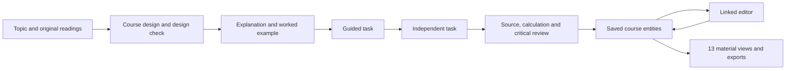

# EduTool

**What do you want to teach/learn?**

EduTool turns a topic and optional source files into editable, linked educational materials. The Studio rebuild is currently a **v0.19.0 release candidate**. [edutool.dev](https://edutool.dev) remains the public deployment; check its `release.json` to identify the version actually running.

## The workspace

Start with one input, or drop PDF, DOCX, TXT, Markdown or CSV files onto it. Choose the audience, language, lesson count and duration, then build a course.

A course contains concrete explanations, worked examples, guided and independent tasks, model answers, diagnostic feedback, rubrics and exit tickets. Its 13 material views are:

- Course map, syllabus and lesson plans
- Slide decks, assignments, rubrics and discussions
- Question bank, study guide and course FAQ
- Student workbook, instructor guide and source reader

These views share course, lesson, task and source entities. Editing a linked field updates its appearances throughout the workspace. Formatting and earlier field versions are retained. A substantive edit reopens instructor review; changing a source invalidates dependent work. Shared text synchronization does **not** prove that a changed question's answer or interpretation remains correct.

Downloads include editable Word, PowerPoint and Excel files, PDF, HTML, CSV and a complete ZIP package. Google Docs, Sheets and Slides exports create files in your own Drive. Downloaded and Google files are snapshots: re-export after editing in EduTool. The question bank currently reuses course practice and exit questions; adapt it before using it as an unseen assessment.

## Run locally

Use Node.js 22 or newer.

```sh
npm ci
npm run dev
```

The development server proxies online generation through the configured Scion Worker. No key is shipped to the browser. To use a different development gateway:

```sh
SCION_PROXY_TARGET=http://127.0.0.1:8080 npm run dev
```

```sh
npm run check       # TypeScript, lint, unit contracts, production build, bundle limits
npm run test:e2e    # One Chromium worker; import, editing, persistence and exports
npm run preview    # Preview the most recent production build
```

Tests use clearly identified synthetic responses for mechanical checks. They do not claim to measure educational effectiveness. Real model generation is a separate, explicit operation:

```sh
SCION_ENDPOINT=https://edutool-scion.xingpicture.workers.dev/api/scion \
SCION_ORIGIN=https://edutool.dev \
npm run studio:generate -- .audit-work/course-review statistics argument-writing museum-zh
```

The generator runs courses and model calls serially, saves checkpoints and retains returned model responses, including rejected candidates. It can resume its saved course files. Fixtures contain fictional, non-sensitive material.

## How the system works



- `src/studio/domain.ts` defines stable identities, source versions, edits and review state.
- `engine.ts` runs bounded generation and repair with resumable checkpoints.
- `evidence.ts` and `context.ts` select exact source passages. The program inserts their original text and addresses; the model does not reconstruct quotations.
- `verify.ts` independently computes supported numerical operations and checks structural contracts. A source match alone does not establish that a claim follows from that source.
- `materials.ts` projects shared entities into different teaching documents. Exporters consume the same projections as the editor.
- `server/scion/worker.ts` protects the server credential and admits requests against shared free quotas.

The production build excludes the previous compiler, Firebase application and research models. Model inference and large extraction/export libraries load only when requested. CI enforces a first-load budget of 330 KiB raw and 110 KiB gzip, including page HTML, CSS and the title font. Chinese PDF fonts are separate optional downloads.

## Hosting without a rented model server

The website is static and deploys to GitHub Pages. Online generation uses **Google's free Gemma 4 31B API** through a Cloudflare Worker and a SQLite Durable Object for admission counters. This avoids a rented GPU server, but it does not provide unlimited capacity or an uptime guarantee.

The configured Google project must remain on its free tier. The gateway allowlist contains only the explicitly configured Gemma models; there is no paid-model fallback. Defaults are 500 attempts per UTC day, 6 attempts per minute, 200 attempts per visitor per day, and 14,000 input tokens reserved in a rolling window with headroom below the observed 16,000-token Google limit. The gateway counts the complete provider request, including system instructions and schemas. Quota failures retain the course for resumption. These limits may need to decrease if provider allowances change.

To deploy your own Worker, configure `server/scion/wrangler.jsonc`, authenticate Wrangler to your Cloudflare account, and set the key as an encrypted Worker secret:

```sh
npx wrangler secret put GOOGLE_AI_KEY --config server/scion/wrangler.jsonc
npm run scion:deploy
```

Do not put the key in a `VITE_` variable, source file or public asset. `ALLOWED_ORIGIN` restricts browser access; it is not user authentication. Daily IP hashes and shared counters limit abuse, but a determined caller can still consume the free allowance. Online generation is available only to adults in eligible regions under the provider's terms. Google's free service may use submitted content for product improvement and human review: do not upload private student records or other sensitive material.

The optional on-device route uses the Gemma 4 E2B base model through Wllama. Its first download is approximately 3.35 GB and it requires a capable device. It is experimental and has not matched the hosted course author in this audit. **Neither the hosted route nor the current browser route loads our trained LoRA adapter.** See [Scion research](research/scion/README.md).

Provider references: [Gemma API](https://ai.google.dev/gemma/docs/core/gemma_on_gemini_api), [pricing](https://ai.google.dev/gemini-api/docs/pricing#gemma-4), [terms](https://ai.google.dev/gemini-api/terms), [available regions](https://ai.google.dev/gemini-api/docs/available-regions), [Workers pricing](https://developers.cloudflare.com/workers/platform/pricing/), [Durable Objects pricing](https://developers.cloudflare.com/durable-objects/platform/pricing/).

## Storage and Google exports

Courses, source readings, generation receipts, edits and formatting live in this browser's IndexedDB. There is no Studio account or automatic cloud backup. Use **Save course file** to keep a portable `.edutool.json` backup; clearing browser data can remove local courses. Studio does not automatically migrate previous compiler projects or Firebase data. See [legacy recovery](docs/legacy-recovery.md).

Google exports use the existing OAuth client with the `drive.file` scope, and hold the access token in page memory. A self-hosted deployment needs its own authorized JavaScript origin/client configuration in `googleExport.ts`. The current local development origin is not registered on the public client; production Google exports must be tested on the authorized domain.

## Release checks and limitations

`Fast verification` checks the current Studio source, contracts, production build, browser flows and the experimental training-mask regression. Successful verification on `main` triggers the Pages workflow, which checks out the tested commit. `release.json` records the version and Git SHA of the deployed build.

Materials remain drafts until an instructor reviews them. Automated checks and a second model pass can miss errors, including unsupported inference, misleading feedback and impractical workload. Release-candidate review is ongoing; real-course output quality and production Google exports are not yet signed off. No claim of proven learning gains, a novel foundation model or universal classroom readiness is made.

See the [changelog](CHANGELOG.md), [current rebuild audit](docs/rebuild-audit.zh-CN.md), and [previous implementation recovery](docs/legacy-recovery.md).
