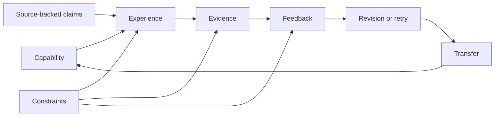

# What If We Rebuild?

_A clean-room vision for Edutool, designed from an empty repository._

_This document assumes nothing must be preserved. No existing architecture,
pipeline, model, file format, interface, or product vocabulary is carried
forward. The only constraints are the real goals: exceptional teaching
quality, zero required API cost, instructor ownership, durable course data,
and a product people choose to use throughout a semester._

---

## 0. The idea in one sentence

I would build:

> **Git + Figma + a compiler + a flight simulator for teaching.**

Not a course-document generator.

Not a chatbot that writes lesson plans.

Not a dashboard with twenty AI buttons.

I would build an **Executable Course Studio**: a place where an instructor
designs a living model of what students should become able to do, rehearses
the course before teaching it, runs it week by week, adapts it when reality
changes, and publishes it as an installable, inspectable, durable package.

For this document I will use the working name **Praxis** for the product. The
name is not the idea. The idea is that a course should behave like a program:
it has inputs, constraints, state, tests, branches, failures, and observable
outcomes. Documents are only compiled views of that program.

---

## 1. The clean-room decision

If I truly had an empty folder, I would make five decisions before writing a
line of application code.

### Decision 1 — The product is the learning loop

The smallest meaningful unit is not a lesson, slide, quiz, or document. It is:

> **Purpose → Experience → Evidence → Feedback → Revision → Transfer**

A course is a network of these loops over time.

Every output exists only to help one of those transitions happen. A slide that
does not change what a learner can notice or do is decoration. A quiz without
useful feedback is measurement without teaching. An objective that never
produces evidence is a wish.

### Decision 2 — AI proposes patches; it never owns the course

The AI cannot directly “generate the course.” It can propose a typed patch:

- add this capability;
- split this concept;
- replace this experience;
- author these missing examples;
- repair this assessment;
- rewrite this explanation for this audience.

Every patch has:

- a reason;
- an evidence basis;
- an impact radius;
- a cost and privacy route;
- tests that will run if accepted;
- a visible diff.

There is no invisible mutation and no magic regenerate button.

### Decision 3 — The first-class output is an executable course package

The canonical artifact is a portable course package, not application state.
It contains:

- the learning model;
- source evidence;
- teaching and assessment assets;
- instructor decisions;
- accessibility metadata;
- quality test results;
- history and branches;
- compiled exports;
- a static student experience.

It opens without an account. It remains inspectable without the original AI
provider. Another tool can read it. A future version can migrate it.

### Decision 4 — Free and local is the default architecture

The application must remain useful with:

- no API key;
- no subscription;
- no application server;
- no internet after installation;
- no local language model, if necessary.

Local models and downloaded knowledge packs can improve authorship, but the
editor, compiler, simulator, validators, exports, and student site do not
depend on a paid call.

### Decision 5 — We measure reality, not output volume

Success is not files generated, tokens produced, features shipped, or internal
quality scores.

Success is:

- less instructor preparation time;
- fewer hidden course contradictions;
- better student evidence;
- faster, clearer feedback;
- less rework during the semester;
- successful reuse next term;
- zero surprise cost;
- durable instructor ownership.

---

## 2. What the product feels like

Praxis has three connected products inside one application.

### 2.1 The Studio — design the course

The Studio is a spatial, visual editor. It is closer to Figma than to a form.

The instructor sees the course through switchable lenses:

- **Journey** — the semester as a sequence of learner transformations.
- **Knowledge** — concepts, claims, misconceptions, and prerequisites.
- **Practice** — what students repeatedly do to improve.
- **Evidence** — how the course knows learning happened.
- **Time** — student workload, instructor workload, and session feasibility.
- **Access** — barriers, accommodations, modalities, and alternate paths.
- **Source** — where claims, examples, and readings came from.

The same course changes appearance under each lens, but the underlying model
does not change.

### 2.2 The Rehearsal Room — test the course before teaching it

The Rehearsal Room is the flight simulator.

It runs adversarial and counterfactual scenarios such as:

- a third of the class skips the reading;
- students enter with uneven prerequisites;
- a snow day removes one session;
- a student uses AI for every take-home task;
- the midterm average is 52%;
- a screen-reader user attempts every required activity;
- a student misses two weeks;
- a lab tool fails on the day it is needed;
- enrollment doubles;
- the instructor has only half the expected grading time;
- a key source becomes unavailable;
- students can answer the quiz without understanding the concept.

The simulator does not pretend to predict human beings precisely. It finds
structural fragility. It asks: if this assumption fails, does the learning loop
still function?

Each simulation produces:

- the first broken loop;
- who is affected;
- evidence of the break;
- the smallest repair;
- what that repair changes elsewhere.

### 2.3 The Control Room — run the living course

Once the semester starts, the product changes personality.

The home screen becomes **Teach Next**:

- what students should become able to do next;
- what happened last time;
- which misconception needs attention;
- today's session timeline;
- materials and prompts;
- an accessible fallback activity;
- what evidence to collect;
- what to do if the class is ahead or behind;
- the smallest preparation still required.

After class, the instructor records a tiny signal:

- landed;
- mixed;
- missed;
- not taught;
- needs another attempt.

That signal can replan the future branch without rewriting the past.

---

## 3. The core model: seven primitives

I would resist a giant schema. The entire system would begin with seven
composable primitives.

### 3.1 Capability

An observable thing a learner should become able to do.

Examples:

- distinguish correlation from causal evidence;
- debug a loop using a trace;
- defend an interpretation with textual evidence;
- calibrate a pipette within tolerance;
- revise a claim after counterevidence.

A capability has:

- an action;
- a context;
- a quality bar;
- prerequisite capabilities;
- evidence that can demonstrate it;
- transfer contexts where it should still hold.

Capabilities replace vague objectives as the spine of the course.

### 3.2 Claim

A statement the course asks learners to understand, use, question, or verify.

A claim is attached to:

- a source excerpt or instructor authority;
- a confidence class;
- applicable contexts;
- known limitations;
- common misconceptions;
- examples and counterexamples.

Generated prose is never the authority. Claims are.

### 3.3 Experience

Something learners do or encounter.

An experience declares:

- which capabilities it exercises;
- which claims it uses;
- its modality;
- time and material requirements;
- expected productive struggle;
- alternate accessible routes;
- what evidence it leaves behind.

Lecture, discussion, laboratory work, rehearsal, critique, reading, fieldwork,
simulation, and peer teaching are all experience types.

### 3.4 Evidence

An observable artifact or performance that changes our confidence in a
capability.

Evidence includes:

- a response;
- a worked process;
- a performance;
- a design;
- an explanation;
- a revision history;
- a conversation or defense;
- a real-world action.

Evidence is not synonymous with a grade. Some evidence exists only to guide
the next teaching decision.

### 3.5 Feedback

Information that helps the learner close a specific gap.

Feedback declares:

- the evidence pattern that triggers it;
- the misconception or missing move it addresses;
- the next action;
- whether a retry is required;
- whether a person or system owns the response.

Every important assessment must have a feedback path before it can be called
complete.

### 3.6 Constraint

A fact the course must respect:

- calendar;
- meeting pattern;
- class size;
- grading time;
- policy;
- accreditation;
- accessibility;
- available technology;
- materials;
- privacy;
- language;
- cost.

Constraints are compiled, not buried in prose.

### 3.7 Source

The inspectable basis for a claim, example, policy, or local decision.

Sources can be:

- instructor material;
- an open publication;
- a licensed resource;
- a dataset;
- an institutional rule;
- an expert assertion marked for review;
- a generated proposal labeled as synthesis.

Every source carries rights and reuse metadata. The system can therefore know
what may be shown, quoted, adapted, exported, or only referenced.

---

## 4. The learning-loop graph

The course model is a graph of relationships, not a folder tree.



The compiler treats missing edges like type errors:

- capability with no practice;
- practice with no evidence;
- evidence with no feedback;
- feedback with no retry opportunity;
- high-stakes evidence before sufficient practice;
- experience that exceeds time or access constraints;
- claim without an allowed source;
- assessment that measures a different capability than it names;
- transfer expected but never rehearsed.

This is the central advantage of rebuilding: pedagogical coherence becomes a
property of the data model, not a hope enforced by prompts.

---

## 5. The first-run experience

The empty-state experience should feel surprisingly calm.

### Step 1 — Tell me the transformation

One prompt:

> “When this course is over, what should students be able to do that they
> cannot do now?”

The instructor can answer in rough language, upload material, or choose to
start from an existing course package.

### Step 2 — Import the world

The product reads:

- syllabus;
- calendar;
- readings;
- assignments;
- institutional requirements;
- sample student work;
- instructor notes;
- accreditation standards;
- existing LMS exports.

It creates proposals, not facts. Every extracted item is traceable to a source
location.

### Step 3 — Ask five high-information questions

The system does not display fifty settings. It calculates which unanswered
questions would most change the course.

Examples:

- Is the final performance individual or collaborative?
- May students use AI during graded work?
- Is conceptual transfer or procedural fluency the higher priority?
- What is the real weekly workload ceiling?
- Which institutional policies must remain verbatim?

The questions are chosen dynamically. If the source already answers one, it is
not asked again.

### Step 4 — Present the course hypothesis

Before generating materials, Praxis proposes:

- the learner transformation;
- 5–12 major capabilities;
- their prerequisite relationships;
- the evidence architecture;
- the weekly rhythm;
- major risks and assumptions;
- source coverage;
- the first unresolved decisions.

The instructor edits this on the canvas.

### Step 5 — Rehearse before expanding

The course hypothesis runs through structural and counterfactual tests. The
instructor sees where the course is fragile before thousands of words are
created.

### Step 6 — Compile only what is needed

The default first compilation is not “everything.” It is:

- the course agreement;
- the first two teaching loops;
- the evidence plan;
- the next-session view;
- the student welcome surface.

The rest compiles lazily as the instructor approves the structure or
approaches that part of the semester.

---

## 6. AI without the AI-product feeling

The primary interface contains no permanent chat panel.

AI appears in four forms.

### 6.1 Proposals

Small cards attached to the object they affect:

- “This capability has no transfer evidence.”
- “These two weeks repeat the same practice pattern.”
- “The source supports a stronger counterexample.”
- “This assessment can be completed without demonstrating the named skill.”

Each proposal has Accept, Edit, Dismiss, and Explain.

### 6.2 Commands

The instructor can open a command surface anywhere and say:

- make this lab work without specialized equipment;
- turn this assessment into an oral-defense version;
- reduce grading time by half;
- preserve Weeks 1–5 and replan the rest;
- create a path for students who missed this prerequisite;
- show me every place this claim appears.

The result is always a previewed graph patch.

### 6.3 Critics

Critics do not author content. They look for specific failure classes:

- unsupported claim;
- false alignment;
- giveaway assessment;
- inaccessible dependency;
- impossible timing;
- grading overload;
- shallow feedback;
- AI-cheatable evidence;
- source/license conflict;
- repeated instructional rhythm;
- prerequisite gap.

Critics can be deterministic, local-model, human, or remote-model plugins.
Their findings use the same contract.

### 6.4 Rehearsal actors

Synthetic learner actors are used only as adversarial probes. They are not
presented as accurate psychological replicas.

Actors have bounded behaviors:

- skips preparation;
- memorizes without transfer;
- holds a named misconception;
- needs a different modality;
- has limited time;
- overuses AI assistance;
- excels early and becomes disengaged;
- requires more attempts.

The question is never “What will this student do?” It is “Does the course
still have a valid path if this happens?”

---

## 7. The $0 intelligence architecture

The zero-cost goal should shape the system from the first commit.

### 7.1 Four intelligence tiers

#### Tier 0 — No model

Always available:

- editing;
- graph operations;
- source linking;
- course tests;
- time and workload checks;
- prerequisite analysis;
- format compilation;
- LMS and document export;
- static student site;
- history, branching, and diff;
- deterministic suggestions.

Tier 0 is a complete product, not an error state.

#### Tier 1 — Local small models

Run in a browser worker or desktop runtime for narrow tasks:

- classify source passages;
- extract candidate claims;
- match concepts;
- detect duplicate meaning;
- rewrite a short segment;
- generate variants;
- classify evidence patterns;
- rank relevant assets.

Small models are not asked to author a whole course.

#### Tier 2 — Local authoring model

An optional downloaded model authors missing typed objects:

- examples;
- counterexamples;
- explanations;
- practice items;
- feedback messages;
- scenario variants.

All output must pass schema, source, rights, and quality gates.

#### Tier 3 — Remote intelligence

Optional and explicitly selected. Used for:

- difficult subject-matter synthesis;
- multimodal source interpretation;
- high-quality voice transformation;
- external critique;
- complex simulation actors.

Remote intelligence competes on quality and speed. It is never required for
ownership, reopening, editing, validation, or export.

### 7.2 Knowledge packs

Instead of making every course buy knowledge again, Praxis downloads
versioned, inspectable packs.

A pack contains:

- source-indexed claims;
- concept relationships;
- examples and counterexamples;
- misconception patterns;
- practice structures;
- open readings;
- license metadata;
- validator fixtures;
- optional local embeddings.

Packs can represent:

- a discipline;
- an institution;
- an accreditation framework;
- an accessibility standard;
- a teaching method;
- a software toolchain;
- a language or region.

Packs are signed, versioned, and removable. The course records exactly which
pack content it used.

### 7.3 Content-addressed reuse

Every accepted atom is stored by content and dependency hashes. If the same
claim, example, or feedback pattern is valid in another context, it can be
reused without inference.

The system tracks:

- exact reuse;
- adapted reuse;
- generated novelty;
- instructor-authored novelty;
- invalidated content;
- source or rights changes.

Over time, the cost of a new course falls because the library becomes richer,
not because the prompts become more compressed.

### 7.4 Hard budget policy

Every operation declares:

```text
money budget
external-call budget
latency budget
energy budget
privacy boundary
quality floor
```

The router may choose any permitted path. It cannot exceed a budget or weaken
a privacy boundary to complete an operation.

“Free” therefore means an enforced plan, not a price estimate after the fact.

---

## 8. The compiler

The compiler transforms the course graph into experiences and formats.

### 8.1 Compiler responsibilities

- schedule learning loops under time constraints;
- preserve prerequisite order;
- create progressive practice;
- distribute retrieval and transfer;
- bind evidence to capabilities;
- bind feedback to evidence patterns;
- enforce workload budgets;
- create accessible alternate routes;
- render instructor and student views;
- produce format-specific packages;
- record provenance for every compiled object.

### 8.2 Compiler non-responsibilities

The compiler does not invent disciplinary truth. It does not decide local
policy. It does not claim a source says something without a source link. It
does not turn a missing decision into polished certainty.

### 8.3 Property-based course tests

Instead of testing only known fixtures, the compiler generates variations and
proves invariants:

- removing a session cannot silently orphan a high-stakes capability;
- changing the class size recalculates feedback feasibility;
- moving an assessment cannot place it before prerequisite practice;
- switching to asynchronous delivery produces a valid participation route;
- a no-internet mode removes dependencies or blocks compilation;
- every major capability has more than one evidence opportunity;
- every known misconception has detection and repair opportunities;
- every student-facing claim has a provenance class;
- every required experience has an accessible completion path;
- every grade-bearing artifact has criteria and feedback ownership.

The course is treated as a program that must type-check under its declared
environment.

### 8.4 Incremental compilation

Edits trigger the smallest affected build:

- edit a claim → recheck dependent experiences, evidence, and explanations;
- change a capability → recheck alignment and assessment coverage;
- move a date → recompile schedule and workload;
- change a constraint → rerun affected simulations;
- revise feedback → recompile only linked student and instructor surfaces.

The UI displays the impact radius before accepting a broad change.

---

## 9. The simulator

The simulator is where the rebuild becomes more than a better generator.

### 9.1 Structural simulation

Deterministic scenarios test:

- time;
- workload;
- prerequisite reachability;
- practice spacing;
- feedback capacity;
- grading capacity;
- resource availability;
- accessibility paths;
- assessment redundancy and gaps.

### 9.2 Learning-path simulation

Bounded learner-state models test whether the course contains recovery routes.

The state model can represent:

- confidence in capabilities;
- observed misconceptions;
- completed experiences;
- evidence quality;
- feedback received;
- retry opportunities;
- transfer success.

It does not infer personality, intelligence, emotion, or protected attributes.

### 9.3 Semester time machine

An instructor can fork the future:

- Branch A keeps the original plan.
- Branch B adds remediation after a weak midterm.
- Branch C removes one week and preserves the final capability bar.
- Branch D replaces a tool-dependent lab.

Praxis compares branches on:

- capability coverage;
- student and instructor time;
- feedback load;
- assessment risk;
- accessibility;
- material changes;
- unresolved decisions.

The instructor chooses the branch. The system never rewrites taught history.

### 9.4 Reality calibration

After teaching, the instructor can compare rehearsal findings with reality:

- predicted weak point vs observed weak point;
- planned workload vs actual workload;
- expected misconception vs actual evidence;
- planned timing vs actual timing;
- suggested repair vs instructor repair.

This improves the instructor's local course model. Contribution to shared
models is optional, deidentified, and inspectable.

---

## 10. The course package

I would use a standard ZIP container with a human-readable manifest and
content-addressed assets.

```text
my-course.praxis/
  manifest.json
  graph/
    capabilities.json
    claims.json
    loops.json
    constraints.json
  sources/
    index.json
    excerpts/
  assets/
  decisions/
  history/
    events.jsonl
    branches.json
  quality/
    latest.json
    reports/
  compiled/
    instructor/
    student/
    lms/
    documents/
  plugins.lock
```

### Package rules

- JSON Schemas are published and versioned.
- Source excerpts remain linked to their rights metadata.
- History is append-only; snapshots are derived.
- Large binaries are content-addressed.
- Compiled output can be deleted and rebuilt.
- Instructor decisions are first-class data.
- Secrets never enter the package.
- The package opens without a network connection.
- A simple command-line reader can inspect and validate it.
- Migrations never require an AI model.

### Git-like course operations

- branch a semester plan;
- compare two versions visually;
- merge an instructor's local changes with a department template;
- cherry-pick an assessment repair;
- revert a broken generation patch;
- tag the version actually taught;
- fork next semester without duplicating immutable assets.

The interface should make these operations understandable without exposing Git
terminology unless the user wants it.

---

## 11. Student experience

The student-facing product is generated as a static, offline-capable site.

It includes:

- course journey and expectations;
- upcoming experiences;
- readings with purpose and rights information;
- glossary and concept map;
- self-check practice;
- feedback and retry paths;
- assignment requirements and exemplars;
- accessibility preferences stored on the student's device;
- a personal learning notebook;
- exportable evidence and revision history.

### Student-owned state

By default, learning state stays with the student.

Students can choose to submit:

- required evidence;
- a progress summary;
- selected notebook entries;
- a self-assessment;
- an accessibility request.

The instructor does not need a surveillance dashboard. They need meaningful
evidence and signals about where teaching should change.

### AI-use transparency

Each assessment declares:

- whether AI assistance is allowed;
- what must be disclosed;
- what process evidence is required;
- whether an oral defense or live demonstration is required;
- what the student remains responsible for knowing or doing independently.

The student site can generate an AI-use receipt locally without sending the
student's work to the application owner.

---

## 12. Instructor experience during the semester

The most important screen is not the generator. It is tomorrow morning.

### Teach Next

One compact view contains:

- today's capability target;
- prerequisite check;
- opening signal;
- sequence and timing;
- examples and counterexamples;
- likely misconception;
- evidence to collect;
- feedback move;
- if-ahead path;
- if-behind path;
- accessible alternative;
- materials already prepared;
- preparation still needed.

### After-class capture

The instructor spends under one minute recording:

- actual timing;
- what landed;
- what did not;
- evidence quality;
- an unexpected question;
- a change for next time.

The product converts this into proposed future patches and a reusable teaching
memory. It does not demand extensive analytics entry.

### Department view

With explicit sharing, a department can inspect:

- capability coverage;
- assessment architecture;
- accessibility readiness;
- workload distribution;
- source and rights status;
- accreditation mapping;
- what changed between terms.

It cannot inspect private notes or student-owned state unless shared.

---

## 13. Technical architecture from an empty repo

I would build the deterministic heart in Rust and compile it to WebAssembly.
The product UI would be TypeScript. This is not because Rust is fashionable;
it creates one fast, portable, strongly typed engine shared by browser,
desktop, command line, tests, and future integrations.

### 13.1 Applications

```text
apps/
  studio-web/          installable PWA for authoring and rehearsal
  studio-desktop/      thin Tauri shell for local models and large files
  student/             static/offline student experience
  cli/                 validate, compile, migrate, diff, and export
```

### 13.2 Core engine

```text
crates/
  course-schema/       canonical types and migrations
  course-graph/        graph operations and dependency analysis
  course-compiler/     incremental deterministic compilation
  course-simulator/    structural and counterfactual simulation
  course-quality/      property tests and normalized findings
  course-package/      package read/write, history, and content store
  course-export/       stable intermediate render contracts
```

### 13.3 TypeScript product packages

```text
packages/
  ui/                  accessible design system
  studio-canvas/       visual graph and timeline editors
  command-runtime/     typed patch proposals and impact previews
  local-models/        WebGPU and desktop local inference
  model-adapters/      optional remote providers
  knowledge-packs/     install, verify, search, and update packs
  plugin-runtime/      permissioned extension sandbox
  exporters/           LMS, document, web, and calendar renderers
  telemetry/           local-first receipts and opt-in diagnostics
```

### 13.4 Evaluation

```text
evaluation/
  fixtures/            small inspectable canonical courses
  adversaries/         structural and learner-path stress cases
  human-protocols/     instructor and student review instruments
  import-roundtrips/   LMS and document interoperability proof
  accessibility/       app and export accessibility proof
  performance/         compile, open, search, and local-model budgets
```

### 13.5 Storage

- OPFS or IndexedDB for the web application.
- SQLite for the desktop shell and CLI.
- Content-addressed blobs for sources and media.
- Append-only operations for history.
- CRDTs only where concurrent editing is actually required.
- Optional encrypted peer or cloud sync as a transport, never the source of
  truth.

### 13.6 Background execution

Every heavy operation runs outside the UI thread:

- compilation;
- simulation;
- indexing;
- local inference;
- export;
- package verification.

Every operation is cancellable, resumable where possible, and emits a typed
progress event.

---

## 14. Plugin system

The application should not hardcode every future model, institution, exporter,
or teaching method.

### Plugin types

- importer;
- exporter;
- knowledge pack;
- validator;
- critic;
- simulation actor;
- model adapter;
- teaching-pattern library;
- institutional policy pack;
- accessibility transformer;
- visualization.

### Permission model

A plugin declares whether it needs:

- course graph read;
- source excerpt read;
- student evidence read;
- package write;
- network access;
- local model access;
- external provider access;
- filesystem access.

The user approves capabilities. Local-only mode makes network permission
unavailable, not merely discouraged.

### Plugin quality

Plugins ship:

- schema compatibility range;
- test fixtures;
- license;
- provenance;
- permissions;
- deterministic or probabilistic classification;
- expected resource use;
- signature.

A broken plugin cannot corrupt the canonical graph or package history.

---

## 15. Design language

The product should feel like a quiet instrument, not an AI casino.

### Visual principles

- The course itself dominates the screen.
- Color communicates state or relationship, never decoration.
- One primary action per context.
- Details appear on demand.
- Generated and sourced content are visually distinguishable without stigma.
- Every warning names an owner and next action.
- The interface shows impact before mutation.
- Empty space is allowed.
- The system never celebrates generating more content.

### Interaction principles

- direct manipulation before configuration panels;
- command palette before permanent toolbars;
- diff before apply;
- branch before destructive rewrite;
- simulation before mass compilation;
- lazy compilation before “generate everything”;
- review queue before score dashboard;
- next teaching action before project analytics.

### Language principles

Avoid:

- magical;
- perfect;
- verified when only machine-checked;
- ready when human decisions remain;
- private when data leaves the device;
- free when a paid fallback is possible;
- intelligence as a synonym for generated prose.

Prefer:

- proposed;
- sourced;
- compiled;
- rehearsed;
- instructor-confirmed;
- locally checked;
- unresolved;
- blocked;
- ready for review;
- taught.

---

## 16. Quality constitution

The product cannot ship a course package that lies about itself.

### Constitutional rules

1. Every student-facing factual claim has a provenance class.
2. Every major capability has practice, evidence, feedback, and transfer.
3. Every high-stakes assessment has prior low-stakes evidence.
4. Every known misconception has a detection or repair route.
5. Every required experience has an accessible path.
6. Every time estimate fits the declared calendar and workload budget.
7. Every grade-bearing artifact has explicit criteria.
8. Every external call is allowed by the operation budget.
9. Every generated patch is reversible.
10. Every unresolved local decision remains visible.
11. Every export discloses degraded or unsupported features.
12. Every public product claim is limited by real evidence.

### Finding states

- **Compile error** — the course model is invalid.
- **Teaching blocker** — a learning loop cannot function as declared.
- **Decision required** — only the instructor or institution can decide.
- **Risk accepted** — the instructor knowingly accepts a named tradeoff.
- **Suggestion** — a non-blocking improvement.
- **Passed property** — an invariant was tested and holds for this version.

The quality surface shows properties and decisions, not a theatrical 99/100.

---

## 17. Crazy ideas worth protecting

These are not required for the first release, but the architecture should make
them possible.

### 17.1 The one-click substitute teacher

The instructor is unexpectedly absent. Praxis compiles a truthful substitute
packet:

- what students already know;
- today's capability;
- a bounded activity;
- materials;
- likely misconception;
- evidence to collect;
- what not to improvise;
- what the instructor should inspect later.

It uses only approved course data and never pretends the substitute has the
instructor's expertise.

### 17.2 Course MRI

A single visualization shows where learning energy flows and where it stops:

- capabilities with too much or too little practice;
- feedback bottlenecks;
- unsupported jumps;
- grading concentration;
- source fragility;
- inaccessible dependencies;
- weeks with no recovery path.

### 17.3 Reverse syllabus

Instead of asking “What content do I cover?”, the system begins with final
student performances and reverse-compiles the minimum claims, practice, and
evidence needed to make them possible.

### 17.4 The anti-course

Praxis generates an adversarial course that superficially looks polished but
violates the intended learning design. Comparing the real course with the
anti-course helps instructors see why structural choices matter.

### 17.5 Assessment escape room

The simulator tries to complete every assessment through shortcuts:

- pattern matching;
- generic AI output;
- memorized definitions;
- answer leakage;
- rubric gaming;
- division of labor that hides individual understanding.

It reports the cheapest path to a grade without the named capability.

### 17.6 Teaching memory that belongs to the instructor

Every after-class note becomes a searchable private memory:

- examples that worked;
- questions students asked;
- timing reality;
- misconceptions observed;
- repairs that succeeded;
- local stories and analogies;
- changes to make next term.

The next course can reuse this memory locally without sending it to a central
service.

### 17.7 A course can explain itself

Click any object and ask:

- Why is this here?
- What source supports it?
- What capability does it serve?
- What happens if I remove it?
- Who must review it?
- Where else does it appear?
- What did students struggle with last time?

The answers come from the graph and history, not a model improvising a
rationale.

### 17.8 The semester replay

At term end, Praxis creates a replay:

- original plan;
- branches and repairs;
- what was actually taught;
- evidence patterns;
- instructor decisions;
- time mismatches;
- suggested next-term fork.

This becomes a course's institutional memory without turning into student
surveillance.

---

## 18. What I would not build

Even with an empty repo and unlimited imagination, I would reject:

1. A chat-first product.
2. A “generate all course materials” first-run button.
3. A required cloud backend.
4. A proprietary course format.
5. A marketplace before the package and permission model are trustworthy.
6. Real-time collaboration before solo versioning is excellent.
7. Student emotion, personality, or intelligence inference.
8. Hidden analytics or training-data collection.
9. A universal numeric teaching-quality score.
10. Model-specific product architecture.
11. A giant prompt as the course schema.
12. Automatic acceptance of generated facts.
13. A mobile authoring app; the student experience should be mobile, the
    Studio should prioritize real design work.
14. More output types as a substitute for deeper learning loops.
15. A simulation that presents itself as a prediction of real students.

---

## 19. Build plan from zero

The build sequence should prove the thesis early and resist horizontal feature
growth.

### Phase A — The course kernel

Build only:

- the seven primitives;
- graph editing;
- source linking;
- constraints;
- append-only history;
- package read/write;
- compiler findings;
- a minimal canvas.

#### Demo

Create a six-session course with three capabilities. Remove one practice
experience and watch the compiler identify the broken evidence loop. Branch,
repair, compare, and export the package.

#### Exit condition

The product is already useful without AI.

### Phase B — The first executable course

Add:

- learning-loop compilation;
- Teach Next;
- instructor and student web views;
- basic document and calendar export;
- workload and timing tests;
- accessible alternate paths;
- one LMS package format.

#### Demo

An instructor designs, rehearses, and teaches the first two sessions from one
course package.

#### Exit condition

Documents are demonstrably views of the course model, not independent content.

### Phase C — Local intelligence

Add:

- source extraction proposals;
- local semantic search;
- typed patch runtime;
- local small-model tasks;
- knowledge packs;
- content-addressed reuse;
- cost, privacy, and energy budgets.

#### Demo

Import a messy syllabus, answer five high-information questions, and receive a
traceable course hypothesis without an API key.

#### Exit condition

Every AI change is a patch with evidence, impact, tests, and rollback.

### Phase D — The Rehearsal Room

Add:

- structural simulations;
- bounded learner-path actors;
- assessment shortcut attacks;
- semester branches;
- branch comparison;
- after-class reality capture.

#### Demo

Simulate a missed week, weak midterm, grading-time cut, and no-reading cohort.
Select the least harmful future branch.

#### Exit condition

The simulator finds important course failures that static document review
misses, and instructors agree the repairs are useful.

### Phase E — The living semester

Add:

- future-only replanning;
- teaching memory;
- student-owned notebook;
- evidence submission interfaces;
- static student site updates;
- department template merge;
- complete LMS import/export proof.

#### Demo

Run a real course through several weeks, preserve taught history, replan the
future, and fork next term.

#### Exit condition

Instructors return during the semester and use the product again for the next
course or term.

### Phase F — The open ecosystem

Only after the package and permission system are trusted:

- publish the SDK;
- open the pack registry;
- support institutional packs;
- support signed validators and exporters;
- support encrypted optional sync;
- support peer review and course forks.

#### Exit condition

An external developer can build a safe importer, validator, pack, or exporter
without modifying the core product.

---

## 20. The first 90 days

### Days 1–14 — prove the data model

- Write the seven primitive schemas.
- Build the graph validator in Rust.
- Build package read/write and migration version 1.
- Create three tiny, hand-authored course fixtures from different disciplines.
- Define the finding contract.
- Implement capability → experience → evidence → feedback checks.
- Build a CLI that validates and explains a package.

**Do not build AI, authentication, cloud sync, or document generation.**

### Days 15–35 — prove the Studio

- Build the canvas with Journey, Knowledge, and Evidence lenses.
- Add direct editing and command-based patch preview.
- Add history, branch, compare, and revert.
- Add source excerpt linking.
- Add constraints and workload visualization.
- Make the three fixtures pleasant to inspect and edit.

### Days 36–55 — prove compilation

- Build Teach Next.
- Compile a static student course surface.
- Compile one instructor handout and one calendar.
- Add incremental dependency rebuilding.
- Add background workers and cancellation.
- Add accessibility and no-internet properties.

### Days 56–75 — prove rehearsal

- Add missed-reading, missed-week, weak-prerequisite, and grading-overload
  scenarios.
- Add branch recommendations as optional patches.
- Add assessment shortcut analysis.
- Conduct five instructor design sessions using the fixtures.

### Days 76–90 — prove zero-cost intelligence

- Add local source extraction.
- Add semantic matching and duplicate detection.
- Add one open knowledge pack.
- Add the operation budget and permission router.
- Demonstrate source → hypothesis → rehearsal → first two sessions with no
  external call.

### Ninety-day decision gate

Continue only if instructors say the graph, rehearsal, and Teach Next surfaces
are more valuable than receiving a folder of generated documents.

If they still primarily want documents, improve the compiled views. Do not
abandon the canonical course model.

---

## 21. How we know this is better

The rebuild is better only if it wins on real behavior.

### Instructor tests

- Can an instructor understand the course model in ten minutes?
- Can they find the first weak learning loop faster than in their existing
  materials?
- Can they make a local change without fearing broad regeneration?
- Can they teach the next session with less preparation?
- Can they recover from a semester disruption without rebuilding the course?
- Can they explain why an assessment exists and what it proves?
- Do they return after the initial build?

### Student tests

- Do students understand what they are becoming able to do?
- Do they know why an experience or reading exists?
- Does feedback tell them what to do next?
- Can they retry important capabilities?
- Can they use accessible alternate paths without receiving a lesser course?
- Can they understand and prove appropriate AI use?
- Do they own a useful record of their learning process?

### System tests

- Does the course open offline?
- Does it remain useful with all models disabled?
- Can it prove zero external calls?
- Can every generated patch be reverted?
- Can every claim be traced?
- Can a broken plugin fail safely?
- Can the package migrate without AI?
- Can another application inspect the format?
- Can one course version be compared with the version actually taught?

### Economic tests

- What percentage of the package required new inference?
- What percentage came from instructor material, open packs, and reuse?
- What is the marginal cost of the second course in the same domain?
- How much instructor time was saved before and during the semester?
- Does the product remain fully functional at $0?

The most important measure is simple:

> **Would the instructor choose to run the next semester through this system,
> even if no new content were generated?**

If the answer is yes, the product has become infrastructure rather than a
one-time AI demo.

---

## 22. The ultimate future

If this works, Edutool becomes an open runtime for courses.

A course is no longer a pile of files locked inside one instructor's laptop or
one LMS shell. It is a versioned, inspectable learning system that can be:

- rehearsed before students enter;
- taught from directly;
- adapted without erasing history;
- audited without reading every document;
- installed into an LMS;
- published as a static site;
- forked for another context;
- merged with institutional requirements;
- run offline;
- improved by local intelligence;
- preserved beyond any particular AI company.

The product's deepest promise would not be “we generate better teaching
materials.”

It would be:

> **Your course can think structurally, remember honestly, adapt safely, and
> remain yours.**

That is what I would build from an empty folder.
