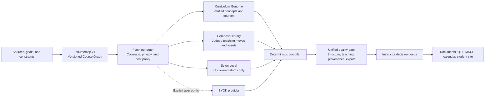

# Edutool V1 Roadmap

_July 9, 2026. Baseline: CourseMapper v0.16.1 on `main`._

_Status: proposed canonical roadmap. This document consolidates the product,
architecture, zero-cost, quality, and adoption direction for Edutool V1. It
does not erase the evidence or implementation history in the existing
CourseMapper, CurriculumOS, Trellis, Composer, Tendril, Scion, and Project Prof
documents. It turns those results into one product sequence._

---

## 0. Executive decision

Edutool V1 will not be a rewrite of CourseMapper and will not be a broader
collection of AI-generated document types.

Edutool V1 will be:

> A local-first curriculum compiler that turns source material into a
> reviewed, coherent, installable course with visible evidence, at $0 by
> default.

The product center is the versioned Course Graph, not a provider, prompt,
model, chat session, or collection of React state. Models supply bounded
knowledge atoms and optional voice. The system owns structure, alignment,
quality, provenance, cost policy, and export integrity.

The V1 strategy is therefore:

1. Make the course a durable file format.
2. Make the Course Graph the only source of structural truth.
3. Make free and private generation enforceable runtime policies.
4. Reuse verified knowledge and judged teaching assets before generating.
5. Ask a model only for the smallest uncovered atom.
6. Compile every deliverable from the same graph and knowledge layer.
7. Replace metric noise with one honest readiness and decision surface.
8. Prove quality with real instructors before making external readiness
   claims.
9. Export an installable course, not only a folder of documents.

No major feature family should be added until the product contract and engine
boundaries in Phases 0 through 2 are complete.

---

## 1. Why V1 exists

CourseMapper already contains most of the ingredients of a durable education
platform:

- a typed Course Graph and deterministic projections;
- a large blueprint compiler with cross-deliverable alignment;
- a Curriculum Genome and source ledger;
- deterministic readiness, classroom, quality, and export checks;
- multiple provider integrations plus local and keyless generation paths;
- Project Prof, Crucible, gold audits, browser checks, and release gates;
- structured DOCX, PPTX, PDF, XLSX, CSV, and ZIP output;
- Trellis, Composer, Tendril, and Scion experiments that measure alternative
  authorship, reuse, judgment, and local-inference strategies.

The problem is no longer missing capability. The problem is that capability
has accumulated faster than product and code structure.

At the V1 baseline:

- `src/` contains roughly 218,000 lines of JavaScript and JSX;
- `src/lib/courseBlueprintCompiler.js` is over 23,000 lines;
- `src/hooks/useDeliverables.js` is over 5,400 lines;
- `src/AppFlow.jsx` is over 4,000 lines and still coordinates several product
  and engine responsibilities;
- provider conditions are repeated across orchestration, generation, stream,
  capability, cost, and agent modules;
- the UI asks users to think about providers, material types, and tuning before
  they have reviewed the course blueprint;
- automated structural scores are strong, but the project still lacks the
  human anchor required for an externally credible “ready to teach” claim;
- the public keyless route and the private local route are not yet presented as
  clearly different trust and privacy modes.

The governing diagnosis is:

> Edutool has a strong engine, laboratory, and knowledge system, but it needs
> one product center and hard boundaries between interface, orchestration,
> intelligence, compilation, quality, and export.

---

## 2. V1 product promise

### 2.1 Primary promise

From a syllabus, course description, or existing project, Edutool produces an
editable course blueprint and a coherent teaching package that:

- shares one structural source of truth;
- discloses assumptions and source coverage;
- never silently spends paid API calls;
- can run with no paid provider;
- can run with no external provider when Private Local mode is selected;
- fails narrowly and honestly when evidence is insufficient;
- preserves instructor edits across regeneration;
- exports into formats instructors can use or install;
- remains readable and migratable even if the application changes.

### 2.2 Primary user jobs

The first screen should organize the product around four jobs:

1. **Build a course** — create a new blueprint and teaching package.
2. **Improve a course** — import an existing syllabus or project and repair
   gaps without replacing the instructor's work.
3. **Prepare the next teaching period** — generate or revise a bounded lesson,
   week, or module.
4. **Audit a package** — inspect alignment, readiness, sources, accessibility,
   and export integrity without regenerating content.

Provider and model selection remain available, but they are an implementation
choice inside generation mode, not the main product decision.

### 2.3 V1 product principles

1. **Blueprint before package.** Users review the course structure and major
   assumptions before the system expands it into many files.
2. **Decisions before dashboards.** Show the smallest set of instructor
   decisions that block safe handoff.
3. **Structure once, render many times.** All deliverables derive from the same
   graph, registries, and knowledge atoms.
4. **Free is a policy.** A zero-cost run cannot escape into a paid retry,
   fallback, repair, or agent path.
5. **Private is a separate policy.** A run that promises no external API calls
   cannot use a public anonymous endpoint.
6. **Claims follow evidence.** “Ready,” “verified,” “private,” and “free” are
   rendered only when the run receipt proves the claim.
7. **The instructor remains the authority.** Dates, institutional policy,
   copyrighted readings, grading decisions, and discipline-specific truth can
   require explicit human confirmation.
8. **No broad regeneration by default.** Edits should recompile affected graph
   regions and deliverables, not recreate the course.

---

## 3. V1 user journey

### Stage 1 — Course brief

Collect only information that changes the blueprint:

- source files or an existing `.coursemap` project;
- course title and subject;
- learner level and context;
- duration, meeting pattern, and modality;
- institutional or program constraints;
- the user's primary job;
- generation mode.

Do not ask for per-deliverable tone, formatting, slide, or quiz settings here.

### Stage 2 — Blueprint review

Before package compilation, show:

- course outcomes;
- concept and prerequisite graph;
- assessment architecture and weight provenance;
- lesson or module sequence;
- modality and artifact-genre decisions;
- source coverage and knowledge gaps;
- inferred assumptions;
- local facts requiring confirmation;
- estimated workload and session feasibility.

The user can approve, edit, or mark items for later review. Edutool may compile
a draft with unresolved non-blocking decisions, but must carry those decisions
into the final review queue and package receipt.

### Stage 3 — Package choice

Replace the initial wall of deliverable types with useful presets:

- **Essential course** — Course Map, syllabus, assessment architecture.
- **Full teaching kit** — essential course plus lesson plans and slides.
- **Assessment kit** — assignments, rubrics, quizzes, and answer keys.
- **Student kit** — study guides, FAQ, readings, and student companion.
- **Custom** — the existing granular material picker.

The preset is only a selection convenience. Deliverables still compile from
the same graph and contracts.

### Stage 4 — Compile

The visible pipeline becomes:

> Map → Ground → Compose → Verify → Review

- **Map:** create or repair the Course Graph.
- **Ground:** link verified knowledge, sources, and reusable assets.
- **Compose:** compile selected course surfaces.
- **Verify:** run deterministic quality and export gates.
- **Review:** present remaining instructor decisions.

Provider names, raw retries, chunk counts, and internal score families belong
in an optional technical receipt, not the main progress surface.

### Stage 5 — Workspace

The stable workspace information architecture is:

1. **Course** — blueprint, sequence, graph, schedule, and registries.
2. **Teach** — lesson plans, presentations, teaching notes, and activities.
3. **Assess** — assignments, rubrics, quizzes, exams, and grade architecture.
4. **Students** — study guides, FAQ, readings, glossary, and companion site.
5. **Quality & Evidence** — readiness, provenance, assumptions, accessibility,
   cost, privacy, and export checks.

The agent remains contextual inside these areas. It does not become the
workspace's navigation model.

### Stage 6 — Review and handoff

The Review queue contains only actionable unresolved items, grouped by owner:

- instructor decision;
- source or copyright check;
- institutional policy;
- discipline review;
- accessibility review;
- system-repairable defect;
- export failure.

The final handoff supports both document export and course installation.

---

## 4. Generation modes and trust contract

“Free” and “private” are not synonyms. V1 must make the distinction explicit.

| Mode                 |       User cost | External inference                         | API key | Primary use                                    |
| -------------------- | --------------: | ------------------------------------------ | ------- | ---------------------------------------------- |
| Free Online          |              $0 | Yes, through a disclosed third-party route | No      | Fastest no-setup start                         |
| Private Local        |              $0 | No                                         | No      | Sensitive course work and durable independence |
| Bring Your Own Model | User-controlled | Yes, direct to chosen provider             | Yes     | Highest optional capability                    |

### 4.1 Free Online requirements

- Name the third-party processing path where the user selects the mode.
- Never describe it as local or fully private.
- Show the exact content class that leaves the browser.
- Keep a visible fallback when the public route is rate-limited or unavailable.
- Never fall through into a paid provider.
- Record the route in the run and package receipts.

### 4.2 Private Local requirements

- No prompt, course source, graph, or generated content leaves the device.
- No public metadata or inference request runs unless the user separately
  enables it.
- Local model unavailability fails with setup guidance, not silent routing.
- Deterministic compilation remains usable when local authoring is unavailable.
- The receipt says `externalCalls: 0` only when the event ledger proves it.

### 4.3 Bring Your Own Model requirements

- The user sees estimated planned calls before starting.
- Reserved retry budget is separate from actual provider usage.
- Provider fallback is explicit and opt-in.
- Nested retries, lesson regeneration, finalizer repair, agent actions, and
  image generation all consume the same run policy.
- A run can be changed from paid to zero-cost, but cannot silently change from
  zero-cost to paid.

### 4.4 Runtime policy

Every pipeline run receives one immutable policy object:

```js
{
  costMode: 'zero' | 'budgeted',
  privacyMode: 'external-allowed' | 'local-only',
  maxPaidCalls: 0,
  maxExternalCalls: null,
  maxTotalCalls: null,
  allowProviderFallback: false,
  allowPublicMetadata: false,
}
```

Rules:

- `maxPaidCalls: 0` is enforced at the provider adapter boundary.
- `privacyMode: 'local-only'` is enforced at the network adapter boundary.
- An absent limit is not interpreted as permission.
- Every adapter emits a normalized usage event.
- The final receipt is computed from events, not from the requested plan.
- A violation is a P0 product defect and a blocking release failure.

---

## 5. Target architecture



### 5.1 Architectural boundaries

#### Application layer

Owns navigation, editing, progress, review, and explanation. It does not know
provider request shapes or compile individual deliverables.

#### Orchestration layer

Owns pipeline phases, dependency scheduling, cancellation, run policy, event
logging, and recovery. `pipelineMachine.js` becomes the phase authority, not
one of several parallel interpretations of progress.

#### Contract layer

Owns versioned schemas for Course Graph, `.coursemap`, blueprint, knowledge
atoms, deliverables, readiness findings, provider usage, and package receipts.

#### Intelligence layer

Owns capability-based provider adapters, local inference, public inference,
knowledge retrieval, asset selection, and bounded authoring. It returns typed
atoms; it does not write directly into UI state or export formats.

#### Compiler layer

Owns deterministic expansion of graph and atoms into deliverables. Each
deliverable builder has a fault boundary and cannot corrupt sibling output.

#### Quality layer

Owns normalized findings, blocking policy, deterministic repair, external
proof, and release gates. It does not own generation.

#### Export layer

Owns format-specific rendering and verification. It receives stable compiled
contracts and cannot reach into React state.

#### Evaluation lab

Owns gold fixtures, Prof, Crucible, Trellis experiments, judge protocols,
browser quality loops, and release proof. Experimental scoring does not leak
into user-visible claims without calibration.

### 5.2 Target repository shape

V1 begins as an extraction inside the existing repository. A monorepo or
framework migration is not required.

```text
src/
  app/                    React shell, routes, screens, and workspace views
  orchestration/          pipeline machine, run policy, events, recovery
  contracts/              schemas, migrations, normalized findings
  graph/                  Course Graph operations and projections
  planning/               coverage analysis and engine routing
  knowledge/              genome, sources, kernels, asset library
  compiler/
    engine.js             dispatch and fault containment
    syllabus/
    lesson-plans/
    slides/
    assignments/
    rubrics/
    discussions/
    quiz-bank/
    study-guides/
    faq/
    shared/
  quality/                gates, repair, receipts, and release policy
  providers/              capability adapters and usage normalization
  exporters/              document and LMS formats
  workers/                compile and heavy validation workers
  storage/                IndexedDB, migrations, backup, import/export

scripts/
  evaluation/             Prof, Crucible, gold, external proof, experiments
```

No production source file should remain a required knowledge silo. The first
split is extraction with equivalence tests, not a semantic rewrite.

---

## 6. `.coursemap` v1: the durable product core

The Course Graph is already the structural source of truth. V1 promotes it
into a public, versioned project format.

### 6.1 Required top-level fields

```text
schemaVersion
project
courseGraph
registries
knowledge
sourceLedger
instructorOverrides
deliverableConfigs
compiledArtifacts
qualityReceipt
runReceipts
history
```

### 6.2 Format requirements

- `schemaVersion` is mandatory.
- Every released schema has a JSON Schema and fixture.
- Migrations are forward-only, deterministic, and tested.
- Unknown extension fields are preserved when possible.
- Instructor-authored overrides are distinguishable from generated content.
- Source and provenance identifiers survive export, import, and regeneration.
- Derived artifacts may be discarded and rebuilt from the graph and contracts.
- A project file never needs an API key or provider credential to reopen.
- The format is documented well enough for an independent reader or exporter.

### 6.3 Storage model

- IndexedDB stores projects, snapshots, assets, and compiled artifacts.
- Local storage keeps only small preferences and non-project flags.
- Quota checks are visible and actionable.
- Autosave is transactional and keeps a bounded version history.
- `.coursemap` export is the universal escape hatch.
- Optional cloud sync is backup and restore, not a dependency for authoring.

### 6.4 Acceptance drills

1. A V1 fixture opens in the current app and after each schema migration.
2. Export → clear local state → import reproduces the graph and instructor
   overrides.
3. Recompilation after import preserves stable identifiers and quality truth.
4. A corrupted optional artifact does not destroy the graph.
5. A project remains usable with every provider disabled.

---

## 7. The zero-cost quality engine

The target is not “use a cheaper model to write the same package.” The target
is to reduce the amount of novel authorship required for each course.

### 7.1 Routing order

For every lesson and required content atom:

1. Reuse instructor-authored source material.
2. Resolve a verified Curriculum Genome kernel.
3. Reuse a judged Composer teaching asset.
4. Apply deterministic transformation and projection.
5. Ask local Scion for the smallest uncovered typed atom.
6. If external inference is allowed, ask the selected provider only for the
   uncovered atom.
7. If the gap cannot be filled safely, produce an explicit review item or
   refuse that surface.

Full-package prose generation is not the fallback.

### 7.2 Typed atom families

Model-authored content should be limited to contracts such as:

- disciplinary fact with evidence;
- key term and misconception;
- worked example;
- teaching move;
- assessment item and explanation;
- authentic task or scenario;
- discussion tension;
- source rationale;
- connective voice segment.

The compiler owns numbering, sequence, alignment references, headings,
tables, policies, scoring structure, accessibility structure, and format.

### 7.3 Reuse and caching

- Cache keys include source digest, graph region, contract version, compiler
  version, model identity, and relevant configuration.
- Cache values carry provenance and gate results.
- A cache hit is not trusted merely because it exists; its contract and source
  dependencies must still be valid.
- Reuse telemetry measures the percentage of package surface compiled without
  new inference.
- Instructor corrections can become local reusable assets immediately.
- Upstream contribution remains opt-in and strips course-identifying content.

### 7.4 Coverage-aware behavior

The product displays coverage before compilation:

- graph and source coverage;
- genome coverage;
- reusable asset coverage;
- locally authorable gaps;
- external-model-required gaps;
- human-review-required gaps.

Zero-cost mode succeeds by maximizing verified coverage, not by hiding gaps
behind generic prose.

### 7.5 Free-pipeline exit bar

A V1 free package must prove:

- zero paid calls;
- no paid fallback opportunity;
- every selected deliverable compiled or honestly failed;
- no P0 quality or export finding;
- source and asset provenance retained;
- cross-deliverable alignment invariants passed;
- unresolved instructor decisions visible;
- the package can be reopened and recompiled without a paid provider.

---

## 8. Quality and evidence contract

V1 keeps the existing measurement culture but gives each instrument a defined
role.

### 8.1 Three user-visible states

- **Ready for instructor review** — no system blocker; local decisions may
  remain.
- **Review required** — the system produced a coherent draft, but named human
  decisions or source checks remain.
- **Blocked** — a structural, quality, privacy, cost, or export contract failed.

Avoid a single percentage that implies more certainty than the evidence.

### 8.2 Unified finding shape

Every validator emits:

```text
id
severity
category
scope
owner
message
evidence
repairability
suggestedAction
blockingPolicy
```

Categories include:

- structure and alignment;
- source fidelity;
- discipline authenticity;
- teaching feasibility;
- assessment validity;
- accessibility;
- privacy and cost;
- export integrity;
- institutional confirmation;
- external proof.

### 8.3 Quality receipt

The receipt shown in the app and stored in `.coursemap` includes:

- graph and lesson scope;
- selected package surfaces;
- generated, reused, repaired, and failed counts;
- source and knowledge coverage;
- actual external and paid calls;
- privacy mode and observed network class;
- blocking and review findings;
- export verification;
- human-proof status;
- exact compiler, contract, and model versions.

### 8.4 Instrument roles

- Unit and contract tests protect implementation behavior.
- Blueprint and gold audits protect deterministic package quality.
- Browser tests protect real product flows and downloads.
- Crucible protects live generation and package behavior.
- Project Prof measures adoption and classroom pressure.
- External proof and human anchors govern public readiness claims.

Passing one instrument cannot silently replace a stricter missing instrument.
`audit:gold` remains a decisive deterministic release gate while V1 is being
extracted.

### 8.5 Human anchor

V1 cannot claim externally proven teaching readiness until:

- at least two instructors review the same package protocol;
- reviews cover at least two discipline families;
- simulated and human tiers agree within the declared tolerance;
- objection overlap and major misses are recorded;
- the public claim audit reads the resulting anchor status.

Automated scores may remain excellent while the claim remains
`SIMULATED` or `UNANCHORED`.

---

## 9. Installable output

Edutool's output should become a course that can be installed, not only a set
of documents that must be re-keyed.

### V1 export priorities

1. Existing DOCX, PPTX, PDF, XLSX, CSV, and ZIP paths remain supported.
2. QTI 2.1 exports typed quiz and exam banks with scoring metadata.
3. IMS Common Cartridge exports modules, pages, assignments, discussions, and
   embedded QTI packages.
4. `.ics` exports the dated semester schedule.
5. A static student companion exports study guides, FAQ, glossary, readings,
   and self-check activities.
6. Accessible variants support large-print and screen-reader-oriented output.

Each new exporter is a renderer over stable contracts. It cannot introduce a
new content-generation path.

### Export acceptance

- Generated packages pass structural validators.
- QTI imports into at least two target LMS environments.
- Common Cartridge imports into Canvas and Moodle test environments.
- Exported identifiers remain linked to graph entities.
- Accessibility metadata exists in the native target format.
- Package manifests disclose unsupported or degraded surfaces.

---

## 10. Phased implementation roadmap

Dates are planning ranges, not promises. Each phase ends only when its exit
gate is proven.

### Phase 0 — Trust contract and feature freeze

**Target:** first two weeks.

#### Work

- Adopt this document as the V1 roadmap.
- Define the one-sentence product promise in product copy.
- Rename and separate Free Online, Private Local, and Bring Your Own Model.
- Align landing, privacy, README, changelog, and receipts with the actual
  Scion route in use.
- Introduce the immutable run policy and normalized usage-event schema.
- Add hard tests for zero-paid-call and local-only enforcement across nested
  retries, finalization, regeneration, fallback, agent, and image paths.
- Freeze new deliverable families and experimental production surfaces.
- Record current V1 baseline metrics and artifacts.

#### Exit gate

- No public copy describes an external public route as local or private.
- Zero-cost and local-only contract tests fail when any forbidden adapter is
  invoked.
- The final receipt is event-derived.
- Existing deterministic and browser release gates remain green.

### Phase 1 — Product center and blueprint-first experience

**Target:** weeks 3 through 8.

#### Work

- Replace provider-first onboarding with the four primary user jobs.
- Build the Course brief and Blueprint review stages.
- Introduce package presets while preserving Custom selection.
- Consolidate progress under Map → Ground → Compose → Verify → Review.
- Build the normalized instructor decision queue.
- Reorganize the workspace into Course, Teach, Assess, Students, and Quality &
  Evidence.
- Make the agent contextual to the active workspace area.
- Ensure the audit-only job never invokes generation.

#### Exit gate

- A new user can reach an editable blueprint before choosing detailed output
  settings.
- Provider selection is optional in the primary journey.
- The user can explain every blocking decision from one Review surface.
- Browser smoke tests cover all four primary jobs.
- No quality, privacy, or cost detail is lost; technical details remain in the
  receipt.

### Phase 2 — Engine extraction and durability core

**Target:** months 2 through 4.

#### Work

- Define `.coursemap` v1 and the migration harness.
- Move project persistence from a single local-storage blob to IndexedDB.
- Split the compiler by deliverable and shared atom families.
- Put a fault boundary around each deliverable builder and exporter.
- Move compile and heavy verification work into a Web Worker.
- Move orchestration out of `AppFlow.jsx` and `useDeliverables.js` into the
  pipeline and run-policy layers.
- Replace repeated provider branches with capability adapters.
- Normalize quality findings and receipts.
- Budget the compiler and orchestration bundles.

#### Migration method

Use a strangler extraction:

1. Freeze an existing compiler entry contract.
2. Extract one pure module without changing output.
3. Run focused unit, equivalence, gold, and twin checks.
4. Route production through the extracted module.
5. Delete the old path only after proof.

#### Exit gate

- `.coursemap` round-trip and migration drills pass.
- Project authoring survives provider unavailability.
- No single production module is the only home of several unrelated
  deliverable contracts.
- Compilation does not block primary UI interaction.
- A failed deliverable or exporter does not destroy sibling output.
- Provider requests originate only through adapters.
- The full deterministic release suite shows no quality regression.

### Phase 3 — Free-quality engine

**Target:** months 4 through 7.

#### Work

- Promote verified Composer assets into a versioned runtime library.
- Add the coverage router across sources, genome, asset library, local Scion,
  and optional external models.
- Restrict new model authorship to typed atom contracts.
- Add content-addressed caching and dependency invalidation.
- Turn instructor corrections into local reusable assets.
- Add self-serve local genome growth for uncovered subfields.
- Expand source-anchored public-domain and open-textbook coverage.
- Route Scion only to gaps where it improves the accepted artifact.
- Expose coverage and refusal decisions before package compilation.

#### Exit gate

- The curated free-package battery completes with zero paid calls.
- Private Local cases complete with zero external calls.
- Reuse rate and uncovered-atom rate are measured per course.
- Library-covered courses compile without broad model prose generation.
- Uncovered courses fail at the narrow missing surface instead of shipping
  generic filler.
- Free packages pass the same structural and export floors as paid packages.

### Phase 4 — Adoption and semester utility

**Target:** months 7 through 12.

#### Work

- Ship QTI and Common Cartridge output.
- Complete application and export accessibility gates.
- Add mid-semester replanning with taught weeks locked.
- Export the static student companion.
- Add instructor voice profiles bounded to tone and presentation.
- Add AI-resilient assessment variants and explicit AI-use policy choices.
- Run instructor anchor rounds and a bounded pilot semester.
- Measure return use, edit burden, and LMS installation success.

#### Exit gate

- At least two instructors complete the anchor protocol across two discipline
  families.
- At least five instructors participate in a bounded pilot or equivalent
  sustained-use study.
- QTI and Common Cartridge imports have recorded proof.
- Accessibility gates cover the app and primary exports.
- Pilot users can replan a future course region without overwriting taught or
  instructor-locked material.
- Public readiness language matches the achieved human-proof tier.

---

## 11. V1 success scorecard

The baseline must be recorded at Phase 0. Targets below are release bars, not
claims about the current application.

| Dimension            | V1 release bar                                                          |
| -------------------- | ----------------------------------------------------------------------- |
| Cost integrity       | Zero-cost mode records 0 paid calls across every tested path            |
| Privacy integrity    | Private Local mode records 0 external calls                             |
| Structural coherence | No unresolved P0 graph or cross-deliverable invariant                   |
| Export integrity     | No failed required export; degraded formats disclosed                   |
| Free-path quality    | Same deterministic quality floor as paid-path packages                  |
| Human decisions      | All unresolved local facts and assumptions appear in one queue          |
| Durability           | `.coursemap` round-trip and migration drills pass                       |
| Fault containment    | One failed deliverable/exporter does not kill the package               |
| Responsiveness       | Compilation runs off the main interaction path                          |
| Installability       | QTI and IMSCC imports proven in target LMS environments                 |
| Accessibility        | App and primary exports meet the adopted accessibility gate             |
| External credibility | Human anchor completed before externally proven claims                  |
| Adoption             | Pilot measures edit burden and next-course reuse, not only satisfaction |

### North-star product measures

1. Time from source upload to editable blueprint.
2. Instructor decisions required before safe handoff.
3. Percentage of package surface compiled without new inference.
4. Paid and external calls per course.
5. Instructor edit time before use.
6. Successful LMS installation rate.
7. Percentage of pilot instructors who return for another course or semester.

These measures outrank internal document count, generated token count, and the
number of available providers.

---

## 12. Release and verification policy

### Every implementation slice

- has one stated product or architecture outcome;
- changes the smallest practical surface;
- adds or updates focused tests;
- runs `git diff --check`;
- preserves unrelated user work;
- records whether the change affects deterministic output, model output, UI,
  export, storage, privacy, or cost policy.

### Deterministic or compiler change

- focused unit and contract tests;
- blueprint quality tests;
- `audit:pipeline`;
- `audit:gold` or the approved bounded precursor followed by full release proof;
- equivalence or paired twin evidence when behavior should not change.

### UI or workflow change

- focused component tests;
- production build and bundle check;
- real browser proof at desktop and narrow widths;
- recovery and failure-state proof;
- accessibility check for the changed surface.

### Provider, privacy, or cost change

- adapter contract tests;
- zero-paid-call and local-only negative tests;
- nested retry and fallback tests;
- receipt correctness tests;
- live check only through the approved local secrets workflow when credentials
  are needed.

### Export change

- structured output test;
- reopened/rendered visual inspection where layout matters;
- package manifest and integrity verification;
- target application import proof for QTI and Common Cartridge.

### V1 release proof

V1 is not complete until:

- fast verification is green;
- strict gold and deep quality gates are green;
- browser product flows are green;
- zero-cost and local-only policy batteries are green;
- `.coursemap` migration and recovery drills are green;
- export-torture checks are green;
- human-proof status is accurately represented in public copy;
- remote CI and deployment are green for the release commit.

---

## 13. Explicit non-goals

Edutool V1 will not:

1. Replace Vite and React with another application framework.
2. Become a required SaaS backend.
3. Add real-time multi-user collaboration.
4. Build a native mobile application.
5. Add new deliverable families before core extraction and quality gates.
6. Hide public inference behind “local” or “private” language.
7. Use a model as the final judge of its own output.
8. Regenerate a whole course when a bounded dependency region can recompile.
9. Treat a high automated score as a substitute for instructor evidence.
10. Preserve legacy generation paths indefinitely after their replacements are
    proven.
11. Turn experimental pipelines directly into production without contract,
    migration, and release proof.
12. Optimize for the largest number of models, settings, dashboards, or files.

---

## 14. Primary risks and mitigations

| Risk                               | Consequence                                         | Mitigation                                          |
| ---------------------------------- | --------------------------------------------------- | --------------------------------------------------- |
| Big-bang refactor                  | Long-lived branch and unmeasurable regressions      | Strangler extraction with equivalence gates         |
| Quality score ceiling              | Green reports hide weak teaching materials          | Human anchors, paired judgment, classroom batteries |
| Provider leakage                   | Zero-cost run spends money or local run sends data  | Immutable run policy at adapter boundaries          |
| Library poisoning                  | One weak reusable asset reaches many courses        | Versioned provenance, admission gates, rollback     |
| Coverage optimism                  | Generic filler ships for unfamiliar disciplines     | Preflight coverage, narrow refusal, explicit review |
| Contract drift                     | UI, package, and export disagree                    | Shared versioned schemas and contract tests         |
| Storage loss                       | Semester work disappears or cannot migrate          | IndexedDB, snapshots, `.coursemap`, optional backup |
| UI simplification hides evidence   | Calm surface becomes misleading                     | Layered receipt with preserved technical detail     |
| Experimental architecture churn    | Trellis/Composer/Scion variants fragment production | One router and stable typed atom boundary           |
| Accessibility debt                 | Institutional adoption is blocked                   | App and export accessibility as release gates       |
| Feature pressure during extraction | Monolith grows while being split                    | Phase-level feature freeze and explicit non-goals   |

---

## 15. First implementation slices

These are the first three bounded slices after roadmap adoption.

### Slice 1 — Honest generation modes

**Outcome:** users can distinguish free-online, private-local, and BYOK modes,
and the receipt proves which one actually ran.

**Likely surfaces:**

- `src/components/ModelConfig.jsx`
- `src/screens/Landing.jsx`
- `src/contexts/AIConfigContext.jsx`
- `src/lib/publicScionProvider.js`
- `src/lib/apiCallBudget.js`
- `src/lib/apiUsageCost.js`
- `src/pages/PrivacyPolicy.jsx`
- `README.md`

**Acceptance:** aligned copy, immutable mode policy, event-derived receipt, and
negative tests for forbidden fallback.

### Slice 2 — Blueprint-first shell

**Outcome:** the primary journey reaches a reviewable blueprint before detailed
material tuning.

**Likely surfaces:**

- `src/App.jsx`
- `src/AppFlow.jsx`
- `src/screens/Landing.jsx`
- `src/screens/FeatureSelect.jsx`
- `src/screens/Config.jsx`
- Course Graph review components and readiness schemas

**Acceptance:** all four user jobs have browser proof; audit-only performs no
generation; the current custom material workflow remains reachable.

### Slice 3 — Provider boundary

**Outcome:** all inference and public metadata access is governed by adapters
that enforce cost and privacy policy.

**Likely surfaces:**

- `src/lib/modelRequestBuilders.js`
- `src/lib/agentProviders.js`
- `src/hooks/useStreamReader.js`
- `src/hooks/useGeneration.js`
- `src/hooks/useDeliverables.js`
- `src/AppFlow.jsx`

**Acceptance:** provider-specific branching begins moving behind adapter
contracts; every request emits normalized usage; zero and local-only policy
tests cover generation, retry, finalization, regeneration, and agent paths.

The slices are intentionally sequential. Slice 1 defines truth. Slice 2 gives
that truth a product home. Slice 3 makes it structurally enforceable.

---

## 16. Definition of Edutool V1 complete

Edutool V1 is complete when a professor can:

1. start from a syllabus, brief, or prior `.coursemap`;
2. receive and edit a transparent Course Graph blueprint;
3. understand coverage and assumptions before package expansion;
4. choose Free Online, Private Local, or BYOK with accurate trust language;
5. compile a coherent package with no surprise paid calls;
6. see only the human decisions that remain unresolved;
7. reopen, migrate, and recompile the project without the original provider;
8. export documents or install the course through stable education formats;
9. use the product throughout a semester without overwriting taught work;
10. trust that every readiness, privacy, cost, and quality claim is supported by
    the package receipt and the project's release evidence.

The architectural completion test is equally direct:

- React renders product state but does not own the compiler.
- The pipeline machine owns orchestration.
- The Course Graph and `.coursemap` own durable truth.
- Provider adapters own inference boundaries.
- The compiler owns deterministic course expansion.
- The quality layer owns blocking and receipts.
- Exporters own format rendering.
- The evaluation lab owns experimental measurement.

When those boundaries hold, Edutool can improve models, knowledge, assets,
formats, and UI without repeatedly rebuilding the whole product.

---

## 17. Source documents and evidence

This roadmap consolidates and should be read alongside:

- `README.md`
- `ROADMAP.md`
- `docs/FABLE5_EDUTOOL.md`
- `docs/ROADMAP_V016_READY_TO_TEACH.md`
- `docs/CURRICULUMOS_V1_DESIGN.md`
- `docs/V0.13_COURSE_GRAPH_IR_ROADMAP.md`
- `docs/PROJECT_PROF_DESIGN.md`
- `docs/TRELLIS.md`
- `docs/COMPOSER.md`
- `docs/TENDRIL.md`
- `docs/SCION_COMPOSER_ZERO_2026-07-07.md`
- `docs/PIPELINE_COMPARISON_2026-07.md`
- `docs/TEACHER_READY_PACKAGE_CONSTITUTION.md`
- `verification-output/gold-sample-quality-audit/latest.md`
- `verification-output/hybrid-pipeline-audit/latest.md`
- `verification-output/professor-adoption/latest.md`
- `verification-output/scion-1.2-gauntlet/latest.md`

If evidence changes, update the baseline and phase status rather than weakening
the product contract.

---

## 18. Status ledger

| Date       | Status          | Evidence                                                                              | Next decision                           |
| ---------- | --------------- | ------------------------------------------------------------------------------------- | --------------------------------------- |
| 2026-07-09 | Roadmap drafted | Current repository, live onboarding inspection, existing quality and pipeline reports | Adopt roadmap and begin Phase 0 Slice 1 |

Future entries are append-only. Record completed exit gates, rejected
directions, and changes to sequencing with the evidence that caused the
decision.
