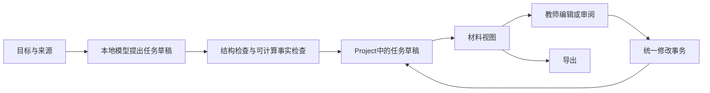

# EduTool：为什么推进这么慢，以及从空仓库重建的方案

日期：2026-09-08  
依据：开发分支 `codex/v0200-teaching-system`，提交 `f7c1e565` 的实际代码和运行记录。  
状态：供产品方向决策的建议。本文没有实施重建，没有删除旧仓库，也不代表旧 v0.20.0 路线图已经完成。

## 1. 我的直接判断

**主要问题是架构与推进方式，其次是模型能力与任务分配不匹配；“产品目标太模糊”不是最主要的原因。**

你的核心要求其实很清楚：极简入口，本地 AI，具体且有教育意义的材料，成熟编辑，改一处关联材料同步，丰富导出。困难在于，我们把很多内部机制和后续产品能力同时塞进了一个版本，却没有及时证明最重要的一条路径已经成立：

> 输入真实教学需求和来源 → 得到值得使用的任务与完整参考 → 编辑一处 → 关联材料正确变化 → 保存重开 → 导出可直接使用。

我对推进方式也有责任。最近的修复并非没有价值，数据恢复、教师修改保护、答案隔离和评分错配都是真问题。但我做了过多局部补丁、局部回放和重复检查，没有足够早地把“新输入上的完整备课成功率”作为决定是否继续沿用架构的依据。**这不能全部归咎于旧代码、Scion 或你的需求。**

我的建议是：**值得尝试一个新内核，但先证明新内核能完成真实备课，再决定是否整体迁移。不要现在就把整个旧产品逐文件重写。** 把原来的责任混乱复制到新仓库，不会变简单。

## 2. 这个判断有什么代码和运行证据

### 2.1 代码规模已经形成明显负担

本次按 `src` 下 JS/JSX/TS/TSX 统计，排除 `__tests__`、`.test.`、`.spec.` 文件：

| 项目                         |             当前规模 | 说明                                                         |
| ---------------------------- | -------------------: | ------------------------------------------------------------ |
| 非测试源文件                 |   664 个，278,656 行 | 包含注释、提示词、静态内容和历史数据，不等于全部都是复杂算法 |
| `src` 内测试文件             |   392 个，136,953 行 | 未包含仓库其他目录的全部测试                                 |
| `courseBlueprintCompiler.js` |            28,956 行 | 一个核心入口承担了大量教学内容与材料生成责任                 |
| `useDeliverables.js`         |             6,627 行 | 生成、恢复、重试、编译、同步等职责交织                       |
| `AppFlow.jsx`                |             4,587 行 | 产品流程和多个状态入口集中在一起                             |
| `nativeGraphAuthoring.js`    |             4,090 行 | 原生生成自身已经相当复杂                                     |
| `src/lib/scion*.js`          | 51 个文件，16,935 行 | 按文件名前缀统计，不表示这些文件都可以删除                   |
| v0.20.0 路线图 / 实施记录    |       797 / 1,740 行 | 记录很充分，但记录量不是产品完成度                           |

行数不是质量判决。例如历史版本数据就占了不少空间。真正的问题是：**一个事实或教学要求要经过多次表示、补充、校验、改写和投影，必须弄清楚每一层现在相信哪份数据。** 单纯把大文件拆成更多小文件不能解决这个问题。

### 2.2 最新真实运行仍然没有贯通核心路径

新样本 `fresh-quantity-en-01` 在运行前登记了输入和核算：South Room 接收40台收音机，其中16台完成检查；North Room的结果未知。

实际结果：

- 得到1课和9类派生材料，**自动形成的共享任务数为0**。
- 原生结构生成没有满足合同，回退到文字管线。
- 发生5次模型请求，记录到1次失败和2次流重试；构建收据约53秒，包含本次加载/生成过程，不能当成稳定的预热速度。
- 回退路径把教师完整的总体限定目标缩成了两句泛化目标。
- 随后修好了目标保留，但该样本的完整任务审阅与教育验收仍未完成。

这说明“成功生成很多文档”和“成功完成一次高质量备课”之间仍有很大距离。

另一个真实问题是：单独重新生成一份材料后，共享任务的其他材料曾保留旧版本。这个问题后来修好了，但它说明同步责任没有从一开始就足够集中。

相关证据：

- [新单元首次运行记录](../research/scion/evaluation/v0.20.0/fresh-units/fresh-quantity-en-01-review.json)
- [单份重生成与关联材料同步](../research/teaching/v0.20.0/shared-regen/review.json)
- [时间线答案与评分修正](../research/teaching/v0.20.0/chronology-evidence/review.json)
- [实际代码：生成流程](../src/hooks/useGeneration.js)
- [实际代码：材料编译与协调](../src/hooks/useDeliverables.js)

### 2.3 Scion 有限制，但我们没有做足干净的归因实验

此前直接让本地模型选择操作类型的两个六输入试验，合法且符合预期的结果分别是3/6和4/6；日期与例外任务仍有错误，候选没有接入生产。

这证明**当前模型、提示协议和任务表示的组合不可靠**，不能单独证明 Gemma 基座本身无可救药。任务可能同时要求它理解教育目标、识别前提、选择内部操作、准确引用、保持严格结构，还要在很小的输出预算里完成；任何一环不合适都会失败。

需要区分三件事：

1. 模型是否理解教学内容、能否提出具体任务。
2. 模型是否能稳定满足我们设计的输出协议。
3. 这些内容经过 compiler 和同步以后是否仍然正确。

我们目前把这三种失败混在一起，再不断添加修复层。这样的结果很难用于判断应该换模型、换协议，还是改架构。

[操作选择试验与未采用决定](../research/scion/evaluation/v0.20.0/operation-selection/review.json)

## 3. 四个原因，应该怎样排序

| 原因                               | 我的判断                                                                     | 应采取的行动                                                     |
| ---------------------------------- | ---------------------------------------------------------------------------- | ---------------------------------------------------------------- |
| 多条生成路径和多份可变表示         | 主要架构问题。原生、文字回退、enrichment、compiler、最终修复之间存在责任重叠 | 只有一个教学内容权威；模型只提出修改，其他层不能偷偷改写教学结论 |
| 推进过程偏向局部优化               | 同样重要，也是我应该负责纠正的部分                                           | 每个里程碑必须交付完整用户路径；不能用更多通过的局部检查替代它   |
| 小模型承担了过多隐式推理与协议负担 | 已有明确失败证据，但尚不足以量化模型自身的能力上限                           | 先做有预算上限的对照试验；减少模型需要理解的内部术语和引用操作   |
| 产品范围缺少阶段取舍               | 核心方向明确，但课程生成、研究、同步、全部导出、作答诊断和教学改进同时推进   | 先证明备课、编辑、同步、导出；后续能力不能阻塞对核心假设的判断   |

因此，我不会说“只要换更强模型就好了”，也不会说“从头写肯定更快”。新仓库可以减少历史兼容与责任交叉；它不会自动解决教育内容质量、本地推理能力和 Office 排版这些真实难题。

## 4. 如果从空仓库做，我会把产品定义成什么

**一个帮助教师把教学意图变成可编辑、彼此一致的教学材料包的工具。**

第一阶段的核心用户是准备课程的教师或培训者。学习者自学可以复用同一内容结构，但暂时不同时建设第二套学习产品。

首页保持简单；视觉和操作习惯参考0.18.7，不以换皮证明重建。输入目标、粘贴资料或拖入文件后，直接进入课程工作区。十类材料使用熟悉的导航，复杂设置放在需要的时候。

最重要的交付承诺是：

> 教师改动一个已确认的任务、事实或要求，相关材料能一致更新，而且之前的个人编辑不会丢失。

不是“任何输入都可以一键生成完美课程”。也不是“compiler 已经等于一个专用小模型”。后者会把内容生成与确定性渲染混在一起，恰好是当前复杂度的来源之一。

## 5. 新内核：一份教学内容，多种材料视图

### 5.1 只有一份教学内容权威

使用一个带版本的 `Project`。下面是概念结构，不是现在就需要实现的大型 schema：

```text
Project
  sources                 原始资料、来源位置、教师更正及其版本
  lessons                 课次、目标、教学顺序、任务引用
  tasks                   题设、要求、推理、答案、评分、错误反馈
  materialEdits           某份材料专属的补充、布局与覆盖
  revisionHistory         可恢复的已确认修改
```

一个任务至少包含：

- 学生究竟要做什么、交什么，以及必要条件。
- 它使用哪些来源和已确认的事实。
- 参考推理、答案，以及资料不能支持的结论。
- 评分标准分别检查哪项已布置的要求。
- 具体错误回答、错误原因和可执行反馈。
- 需要时关联另一个独立练习任务，而不是复制原题后称为迁移。

**不再同时维护可以独立改写的 CourseMap、CourseIR、Blueprint、Kernel 和材料答案。** 如渲染需要临时中间结构，它只能从 `Project` 派生、随时重建，不能成为另一个写入入口。

### 5.2 模型写教学草稿，compiler 不编造教学内容



草稿也能立即显示为可编辑材料，不要求教师先通过一套逐字段向导。是否经过教师审阅是任务的真实状态，不能因成功渲染就自动改成“已确认”。

模型负责有语义创造性的部分：任务设计、解释、参考推理、合理错误例和教学安排。它可以提出来源关联，但不能自行给这些关联盖上“已核实”的章。

compiler 负责：组织、排序、复用、版式、答案隔离、导出，以及明确支持的计算。它不应根据一个主题名自动拼出大量通用活动，也不应为了满足字段数量而补写没有依据的答案。

计算模块只做自己可以验证的事情。例如分数、加权比例、单位换算、日期和评分合计。验证16/40＝40%并不能证明16和40取自同一总体；后者必须保留来源与审阅依据。

### 5.3 来源引用不再要求模型填写大量位置字段

- 文档导入时生成稳定的来源与段落ID，保留原文。
- 模型引用来源ID和必要原句；程序查找位置、验证引用是否存在。
- 重复句子或语义角色有歧义时，在正文旁让教师选择或更正。
- 正常审阅主要看题目、来源摘录、答案和评分，不把十几个内部 binding 字段变成默认工作流。
- 教师改编题设或更正事实必须保留记录，不能把修改后的话伪装成上传文件中的原话。

引用精确匹配只证明“这句话存在”，不证明模型对它的解释正确。新系统也必须诚实保留这条边界。

## 6. 我会怎样实现你最重要的同步功能

### 6.1 编辑共享内容，直接修改共享实体

例如，作业中的题目和幻灯片中的同一题目都引用 `task.prompt`。在任一材料中修改这道题，提交的是同一个字段的修改事务；不需要另一个模型猜测两段文字是否应该同步。

同样，参考答案、评分要求和明确绑定的事实都有稳定身份。材料渲染器读取这些身份，不保存各自独立的“正确答案副本”。

### 6.2 区分共享内容与材料专属内容

| 修改                                 | 行为                                         |
| ------------------------------------ | -------------------------------------------- |
| 改任务题设、共同答案、评分要求       | 更新共同任务，并刷新相关材料                 |
| 改某页幻灯片布局、加课堂口头提示     | 只保存在该材料的局部编辑中                   |
| 改来源或教学要求，导致旧推理可能失效 | 显示受影响任务的简短修订预览；确认后整体应用 |
| 教师覆盖了一个派生段落               | 保留覆盖；冲突仅在该位置提示，不静默覆盖     |

编辑器在进入具体字段时说明它是共享内容还是本材料内容。不要在每个页面堆一长排提醒。

### 6.3 “改一处同步”不能被解释为“任何语义改动都能瞬间证明正确”

把已确认的练习题设总数从40改成50，在明确的比例计算结构中，可以确定性地把16/40改成16/50及32%，再刷新题目、答案、评分和示范。

但把“计算比例”改成“解释原因”，不是改几个字段就能得到正确答案。系统应提出新的任务和评分修订，保留旧版本，等待教师确认。**我们要自动处理可靠的依赖传播，也要把真正需要重新思考的地方做得容易修改。**

### 6.4 写入流程保持简单

所有共享修改经过同一入口：

`读取当前版本 → 生成变更 → 检查受影响内容 → 原子提交 → 保存历史`。

预览后有新编辑就拒绝旧提交。撤销恢复受影响实体的先前值。单用户本地产品先不引入多人协同、CRDT 或分布式事件系统。

## 7. Scion：先证明它能做好核心工作，再围绕它建设

### 7.1 必须先做的可行性试验

空仓库的第一项工作不是导航、账户或十个材料 schema，而是一个任务生成小程序。

固定12个此前未用于调试的教学输入，三类任务各4个，中英文各半。记录原始输入、输出、延迟、失败和教师修改。已有失败样本保留为回归资料，不能换个文件名当新案例。

只比较两种预先规定的简化协议，不无限微调同一批题：

1. 直接生成一份紧凑而完整的任务草稿。
2. 先生成任务内容，再做一次有界的结构整理。

一次结构修复只能修复结构，不能偷偷发明来源、改答案或替换题目。最终选择的流程必须把实际调用次数说清楚。

以下是建议的试验门槛，**不是已取得的结果，也不是任意学科质量保证**：

- 至少9/12能够在不替模型重写核心任务和答案的前提下，得到可继续备课的任务。
- “能够继续备课”必须逐项看题意、可执行性、推理、答案、评分与来源限制；JSON合法不算通过。
- 记录每份材料需要的实质修正，而不只记录是否最终凑出了一个结果。
- 数学错误、伪造来源、答案与评分矛盾等严重问题必须明确暴露，不能由漂亮的总体分数抵消。
- 之后用另一组未暴露输入验证；开发试验的通过率不能直接用作发布成绩。

如果两种合理的简化协议仍明显达不到门槛，就停止扩建应用。下一步是比较适合目标设备的其他本地模型、评估有数据支持的微调，或者明确缩小可自动完成的范围。**不能继续用更多模板、重试器和评分器掩盖模型不能完成核心工作。**

### 7.2 只保留一个本地推理入口

保留目前可工作的浏览器运行时能力，提供很薄的加载、生成、取消、状态和释放接口。无需把已有底层推理工作重新发明一遍，但不搬入整套历史 provider 路由和回退编排。

一个教学任务可以包含多项有教育意义的内容；不能为了“一次调用”宣传而把任务压缩成空泛句子。调用预算按清楚的教学产物分配：有必要的新任务才生成，九种排版不各自再问一次模型。

多课课程可以先生成简短课次计划，再逐课、逐任务串行生成。每一步保留已完成结果；失败只处理当前任务，不重新生成整个课程。

### 7.3 如何看待 adapter 与“自己的技术”

Adapter仍然是可研究的办法，但它不是免费的推理服务器，也不是性能一定变好的证据。只有基座与adapter在同输入、同设置、未暴露样本上比较后，才能说它改善了什么。

Scion可以成为稳定的产品能力入口，而不必先被包装成一个独立基础模型。现阶段我不会把“拥有前无古人的模型技术”设为产品发布前提。

真正值得积累的东西是：教学内容结构、可靠修订、经过审读的任务和错误反馈、真实教师修改行为。它们必须首先让产品更好用，之后才可能形成技术资产。

### 7.4 不租服务器的现实边界

新方案仍以浏览器本地推理、本地保存、静态网站为主，不恢复免费的共享在线模式，不引入付费推理依赖。

但“无需租GPU服务器”不等于“所有设备都能运行同一个模型”。不支持推理的设备仍应能查看、编辑和导出已有材料；不能对它们承诺同等的本地生成能力。模型文件分发、下载失败、设备内存和存储仍然要实测。

如果未来要求任何手机、任何浏览器都能直接获得同等生成体验，就必须重新讨论模型大小、设备要求或计算资源来源。架构重写不能消除这项约束。

## 8. 十类材料和导出怎样做，才不会再次长出巨大 compiler

这些材料仍然是完整产品的目标，不因为先验证内核就取消：

| 材料               | 从共享内容中组织什么               | 必须额外检查什么                       |
| ------------------ | ---------------------------------- | -------------------------------------- |
| Course Map         | 课次、目标、任务与进度关系         | 目标覆盖、顺序和总工作量               |
| Syllabus           | 课程范围、要求、评价安排           | 不发明政策、先修要求或真实机构信息     |
| Lesson Plans       | 示范、练习、提问、讨论、收束       | 教师能按步骤实施，时间可行             |
| Slide Decks        | 教学叙事、图示需求、任务与讲者提示 | 字号、密度、分页、教师答案展示时机     |
| Assignment Briefs  | 具体任务、材料、交付与作答区       | 学生不需要猜题意，且不泄露参考答案     |
| Rubrics            | 要求、证据、等级、错误边界         | 能区分理解程度，不评价题目未要求的表现 |
| Discussion Prompts | 值得讨论的问题、依据与追问         | 不只是复述题干，允许有依据的不同判断   |
| Quiz & Exam Bank   | 可评分任务及独立练习               | 重复练习不冒充新情境，答案与分值一致   |
| Study Guides       | 示例、解释、自测与独立练习         | 示例完整，自测先于答案，学习路径明确   |
| Course FAQ         | 来自课程要求的实际疑问             | 不用生成一堆同义问答来填数量           |

材料渲染器可以有各自的教学组织方式，但不能成为十个独立的教学内容生成器。材料缺少必要内容时，回到共同任务补齐；不要在导出阶段临时让模型补答案。

编辑预览和导出使用同一份语义文档块：标题、段落、任务、表格、答题区、教师参考等。Word/PDF、PowerPoint、CSV、Google导出和ZIP按适用材料连接这些块，不把每种格式重新当成独立内容。

可以复用已经实测过的导出能力；不过Word/PDF和幻灯片的分页、空间与布局仍然需要各自测试，不能因共用数据就省略真实渲染。Google文件和下载文件是快照，不能宣传外部修改会自动回流。

## 9. UI/UX：把复杂度留在系统里，把教学内容放到前面

### 9.1 我会采用的三个界面原则

1. **默认只看到当前要完成的工作。** 不同时展开聊天、课程图、来源、评分和设置五个面板。
2. **直接编辑材料。** 普通修改不需要先向agent发指令，也不需要进入另一套结构管理系统。
3. **少打断，但不隐藏真实问题。** 正常保存与同步安静完成；只有会影响当前操作的具体问题才出现。

视觉上保留0.18.7熟悉的克制感和材料名称。页面以清晰的文字、留白和纸面内容为主。即使使用一点粉笔或手绘元素，也只用于品牌和轻量装饰，不用纹理、手写正文或大量动效影响编辑和课堂打印。

### 9.2 首页：一个明确输入，一个主要动作

```text
                         EduTool

                What do you want to teach/learn?

          ┌──────────────────────────────────┐
          │ 描述课程目标，或拖入教学资料…       │
          │                                  │
          │  📎 添加资料                       │
          └──────────────────────────────────┘
            [已添加的文件]     [调整课程设置]

                       [生成材料]

                 继续上次课程 · 打开工程
```

这是布局构想，最终视觉以简单、清晰为准，不要求把这些文字全部常驻展示。

- 文件直接拖入输入区；添加后只出现简洁文件项，可查看和移除。
- 学生水平、课时和语言优先从输入中提取。有合理默认值时直接使用，设置入口可修改。
- 只有缺失信息确实会改变整个教学任务时，才问一个短问题，例如授课对象；不弹出长表单。
- 可以先从描述开始，没有上传文件不应该让整个产品无法使用；但系统不能因此伪造引用。自拟例子明确作为自拟例子。
- 不放功能卡片墙、模型排行榜、API额度、质量总分或长篇agent欢迎语。
- 不强制登录。账户、云同步和其他服务不能成为本地备课的前置步骤。
- 设备兼容性在实际使用本地生成时检查。不能运行时给出一句明确说明和可行入口，不反复尝试和循环报错。

### 9.3 工作区：左边切材料，中央直接编辑

桌面默认两栏，右侧不常驻agent：

```text
┌──────────────────────────────────────────────────────────┐
│ 课程名称                 已保存              修改…  导出  │
├──────────────┬───────────────────────────────────────────┤
│ Course Map   │ 第2课 ▾                  当前材料的编辑工具 │
│ Syllabus     │                                           │
│ Lesson Plans │  课堂任务：……                              │
│ Slide Decks  │  背景材料、题目、活动、答案或评分             │
│ Assignments  │                                           │
│ Rubrics      │  直接点击内容编辑                           │
│ Discussions  │                                           │
│ Quiz Bank    │                                           │
│ Study Guides │                                           │
│ Course FAQ   │                                           │
│              │                                           │
│ 来源与文件    │                                           │
└──────────────┴───────────────────────────────────────────┘
```

- 左栏只承载材料导航，不同时塞课程树、任务图和版本树。十类材料始终完整可达，不另起难懂的产品名称。
- 课次在内容区上方切换。Syllabus等全课程材料不显示无意义的课次筛选。
- 右侧抽屉只在查看来源、比较改动等具体操作时打开，用完可收起。窄屏不挤成三栏。
- 初次生成后优先打开本课可用的教案或练习，让教师看到实际内容；不先展示一个“生成成功”仪表盘。
- 当前材料保留适合它的编辑器。幻灯片是幻灯片编辑体验，表格是表格；不强行让所有材料变成JSON表单。
- 课次与材料切换保留阅读位置、选择范围和未完成的局部输入。

### 9.4 AI只在需要时出现，不占据半个产品

全局“修改…”和选中文字后的上下文动作使用同一个轻量输入条：

```text
修改范围：[这道题 ▾]
让学生必须解释为什么不能直接平均两个百分比。
                                             [提出修改]
```

常用动作可以很少：解释更清楚、调整难度、生成新练习、自定义修改。它们提供编辑捷径，不各自变成新的agent和面板。

- 默认范围是选中内容或当前任务；跨整课、全课程的修改明确选择范围，避免误改。
- 没有选中内容时，用当前课次作为上下文，不让教师重新讲一遍课程背景。
- agent回复以结果为主，例如“已提出题目和评分的两处修改”。不输出长篇计划、重复用户输入或流水账。
- 如果需要追问，只问一个会改变结果的关键问题。
- 历史记录按需查看；不让聊天记录成为理解当前课程的必要入口。
- 模型理解自由文本的修改请求后仍要提交结构化变更，不绕过统一事务直接改材料。

### 9.5 共享编辑应当自然，而不是变成复杂的同步设置

普通字段点击就能编辑。编辑一个共享字段时，旁边出现很轻的提示，例如“用于教案、练习和评分”。需要时可展开查看关联位置。

- 手工改已确认的数字、标题或题目，正常保存后刷新依赖材料；不再弹一次确认框。
- 只想改变当前材料时，在字段菜单选择“仅修改此材料”，形成明确的局部覆盖。
- 大的语义改写使用一次修改预览，展示真正变化的题目、答案和评分，不要求阅读完整JSON差异。
- 有教师覆盖冲突时，只显示该位置的旧内容、教师内容和建议内容，支持保留个人修改。
- 永久可用的撤销比连续的“你确定吗”更重要。

```text
将更新：题目、参考答案、评分依据

题目     原内容 → 建议内容
评分     原要求 → 建议要求

                          [保留原样]  [应用更改]
```

这个预览用于有实质影响的提案，不应出现在每次普通输入、保存或材料切换中。

### 9.6 来源与质量：靠近内容，少而具体

- 引用显示短标记，点击或键盘聚焦后查看完整原文与文件位置。
- 较大的来源包在抽屉中搜索、选择，不让教师重复粘贴；重要限定不能只显示截断后的半句话。
- 需要处理的问题标在对应题目、答案或来源旁，例如“这条结论没有资料支持”。
- 多个问题可以合成一个简洁入口，但展开后不能隐藏严重问题。
- 不显示看起来精确的“教学质量92分”；不反复提醒“AI可能出错”。
- 草稿不会被系统自动标成教师已审阅。导出行为也不等于完成独立教育验证。
- 明确错误或数据损坏要给出具体修复操作；不把所有不确定性都变成全局阻断。

简约不是把风险藏起来，而是把信息放在能立即理解和处理的位置。

### 9.7 导出：一个入口，三个必要选择

```text
导出

版本      学生用 / 教师用
格式      PDF ▾
范围      当前课 ▾

                         [导出]
```

- 只显示当前材料适用的格式；保留原有丰富导出能力，不把所有格式按钮铺在工具栏上。
- 作业和题库优先提供学生版，教师版显式选择；其他材料根据用途设置默认项。
- 保留最近使用的合理设置，但版本和范围始终可见，避免误导出整课或教师答案。
- 学生导出必须真正移除答案与教师评语，不能只是界面隐藏。整包导出将学生与教师材料分开。
- 私有角色信息不能混入公共讲义，应按角色分别输出。
- 导出失败就在该入口给出简短原因和重试，不清空编辑中的材料。

### 9.8 生成、保存和错误恢复都保持低干扰

- 生成时直接进入工作区，已经完成的课次可看、可编辑；只保留一处进度和停止动作。
- 显示“正在生成第2/6课”这类真实进度，不编造精确百分比，也不暴露内部kernel、token和修复次数。
- 某课失败，只在该课给出继续编辑或重试选项，不让整个课程消失。
- 自动保存成功使用安静状态；保存失败才显示持续但简短的提示，同时提供下载工程保底。
- 刷新、误关和重新打开工程后恢复到明确的位置，不把旧任务误显示为仍在生成。
- 详细运行记录留在开发诊断里，正常教师界面不展示技术审计面板。

### 9.9 手机、键盘和课堂使用

- 手机默认单栏：顶部切材料和课次，正文占满宽度；来源和修改预览用独立抽屉或全屏面板。
- 不把桌面三栏缩成三条窄列，不依赖悬停才能操作。
- 文字选择、键盘导航、撤销、焦点返回和明确按钮名称必须可用。
- 桌面可以进入专注编辑或授课预览，临时隐藏导航和编辑控件。
- 手机端是否能生成模型内容取决于真实设备能力；查看、编辑和导出体验要与推理兼容性分开处理。

### 9.10 用实际操作验证“简约高效”

以下是拟定的交互目标，不是现有测试成绩：

| 教师要做什么               | 默认路径                                         |
| -------------------------- | ------------------------------------------------ |
| 有明确目标和资料，开始生成 | 一次输入或拖入，点击一次生成，不经过强制设置向导 |
| 查看另一种材料             | 左栏一次点击                                     |
| 修改普通正文               | 点击或选中内容，直接编辑                         |
| 修改共享事实并同步         | 编辑一次，自动传播；可撤销                       |
| 提出跨题目与评分的语义修改 | 输入修改要求，审阅一次变更预览                   |
| 导出当前材料               | 打开导出，默认项合适时一次确认                   |
| 恢复上次工作               | 一次继续，回到原课次与材料                       |

验证时记录误点、找不到入口、重复输入、手动核对和修复次数。需要特别配置的复杂操作另行统计，不能用简单任务的最少点击数冒充所有场景。

真正好的界面不是“按钮尽可能少”，而是教师不用理解我们的内部架构，也能完成工作。

## 10. 新仓库的模块边界

```text
src/
  domain/          Project、任务、来源、修订与纯检查函数
  generation/      本地模型接口、任务提案、有限修复
  documents/       语义文档块和十类材料投影
  editor/          共享字段编辑、材料局部编辑、修改预览
  persistence/     本地保存、恢复、历史与工程文件
  export/          各格式转换、学生/教师版本和打包
  app/             首页、工作区、设置与应用装配
  legacy-import/   旧工程单向导入与兼容隔离
```

这不是要求另造一套框架。继续使用熟悉的前端技术和已经成熟的编辑器，重点是写入边界与依赖方向：

- 领域层不依赖界面、模型或导出器。
- 模型返回提案，不能直接写数据库或修改当前课程。
- 所有材料读取同一教学结构。
- 界面操作经统一事务修改内容。
- 导出器不调用模型。
- 旧工程兼容代码不能渗透进新生成流程。
- 渲染缓存可删除重建，不能恢复成另一个教学内容权威。

不把代码行数上限当质量指标，但不允许用一个不断增加条件分支的大文件承包整个备课过程。

## 11. 实施顺序：每一步都必须给出可操作的结果

| 阶段                  | 实际交付                                                        | 退出条件与停止条件                                                         |
| --------------------- | --------------------------------------------------------------- | -------------------------------------------------------------------------- |
| A：验证模型与任务协议 | 无完整产品外壳的本地任务生成小程序                              | 完成预先规定的对照与新输入检查；不达标就先改变模型/协议决策，停止扩建      |
| B：贯通最小备课流程   | 输入来源 → 任务草稿 → 作业编辑 → 一处修改 → 保存恢复 → Word/PDF | 真实操作完整完成；至少一次事实变化和一次教师覆盖都不丢数据，答案与评分对应 |
| C：扩展材料与编辑     | 十类材料、共享字段与局部编辑、全部适用导出                      | 同一个任务出现在不同材料中，各司其职；关键修改正确传播，没有多份答案权威   |
| D：完整课程与发布     | 三套六课课程、首次使用、错误恢复、部署候选与线上测试            | 教学顺序、独立练习、全部输出和原站发布路径通过；版本与实际线上提交一致     |
| E：建立使用反馈闭环   | 基于真实教师使用，再加入作答诊断与教学改进                      | 先证明备课与修订值得反复使用，再扩大产品责任                               |

这里没有承诺“几天就全部重建”。排版、迁移和本地模型都存在尚未解决的风险。**时间估计应在A和B有实测结果后给出，而不是现在用一个乐观日期取代证据。**

如果采用这条新产品路线，我建议将完整学生作答诊断、自动研究代理、多人协作和自动教学改进推后。需要明确：这是新的产品取舍，不能据此把旧 v0.20.0 路线图中的对应要求划成已完成。

## 12. 怎样防止重建重演这次过程

### 每个开发任务必须回答三个问题

1. 教师现在能多完成哪一步实际工作？
2. 什么证据能证明这一步完成，而不只是函数返回正确？
3. 它有没有新增第二份教学内容权威或隐藏回退？

### 控制复杂度的具体规则

- 首个完整流程通过以前，不增加新代理、新质量评分系统或新的中间教学表示。
- 一个模型阶段最多一次明确的修复；失败进入可编辑草稿，不再自动穿过多层回退。
- 一个可靠性问题用一处有责任归属的修复解决，不在每个材料和出口各写一遍补丁。
- 同一批输入经历预先规定的两种协议仍失败，就做架构或模型选择，不继续无上限提示词调参。
- 一次变更先跑相关检查，完成可审阅交付时再跑完整检查；只有新修改或新风险才重跑已通过的重型验证。
- 保存失败与输出，但不为每个措辞变更增加一份长报告。维护简短的“已完成流程 / 当前失败 / 下一决策”记录。
- 成绩至少分成：自然生成完成、教师修正后完成、确定性编译、真实导出、线上验证。不能合成一个“通过率”掩盖差异。

### 发布前的证据仍然要严格

新任务上的题目可解、答案可核、rubric有区分度、学生版不泄露答案、教师编辑不丢失、版本恢复可靠、输出不裁切、部署与源码一致，这些都不能省。

可以删掉重复、镜像实现或只验证模板存在的测试；必须保留能发现错答案、错引用、旧版本提交、编辑丢失和答案泄露的测试。独立教师验证和真实学习效果另列状态，不能由模型自评代替。

## 13. 旧项目哪些值得留下，哪些不搬

### 优先保留，但通过接口和证据筛选

- 0.18.7 的产品习惯与成熟编辑交互。
- 已验证的本地模型加载、取消、资源释放经验。
- 真正发现过数据丢失、错误同步和答案泄露的回归测试。
- Word/PDF内容构建、中文字体、学生与教师版本隔离、Office及ZIP导出经验。
- 原始教学样本、失败输出和版本记录。
- 教师已有工程中的内容、个人编辑和附件。

### 不原样搬入新内核

- 多条互相接管的生成与补救管线。
- 主题匹配后自动拼大量教学文字的巨大模板分支。
- 可被多处改写的答案、副本及互相推测的同步状态。
- 用字段数、文本长度或模板覆盖度代替教育质量的综合分数。
- 没有实测收益却必须经过的代理、自动研究或全局修复阶段。
- 让教师承担内部模型路由和大量精确引用字段的默认界面。

研究能力将来仍然可以加入，但它应该提交带来源的可审阅资料，不能在后台悄悄重写已经确认的课堂事实。

## 14. 重建与迁移的决定方式

我建议先在独立的新内核中完成A和B，旧站保持可用。用相同的新教学输入比较旧系统与新系统：

- 完成一次可用备课需要多少实质修改。
- 初次生成和失败恢复的实际时间、调用次数。
- 改一个事实以后有多少地方需要教师再手动检查。
- 保存重开后，个人编辑与材料之间是否一致。
- 同样内容导出后，需要多少排版修正。

**只有新内核在完整流程上明显更好，才逐步迁移十类材料和旧工程。** 不能因为目录更整齐、测试更少或界面更漂亮，就宣布重写成功。

旧工程通过单向导入适配器迁移：原文件保留，支持的共享内容转入新结构，无法可靠映射的教师材料保留为可编辑的独立文档并说明同步边界。不能猜测旧文字之间的关系，也不能为了迁移成功丢掉教师内容。新工程格式必须有版本，不承诺旧网站能无损读取新结构。

## 15. 我的最终建议

如果让我从空仓库做，我会先证明两件事：**本地模型能否生成值得使用的具体任务；一个共同任务能否在编辑、同步、保存和真实导出后仍然可靠。**

前者不成立，就调整模型或自动化范围；后者不成立，就调整数据与编辑设计。两者成立以后，再把已经成熟的材料和导出能力接回来。

我支持重建内核的方向，但不支持未经验证的一次性全量重写。我们需要改变的不只是代码摆放位置，而是让每一层承担清楚的责任，并用完整用户结果决定下一步是否值得继续。
