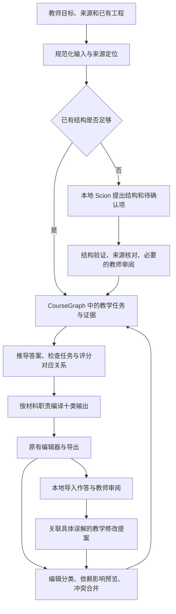

# EduTool v0.20.0 Roadmap：可验证、可修改、可持续改进的教学材料

> **2026-09-12 当前复核：** 线上已为 v0.19.99（提交 `73626af`）；下文关于 0.19.2、开发分支及阶段进展的表述保留为历史快照。当前完成范围、真实缺口和下一阶段建议见 [路线图复核与执行建议](v0.20.0-review-2026-09-12.zh-CN.md)。v0.20.0 尚未完成；原发布门槛与失败记录保留。

## 原计划与历史状态（截至 2026-09-08）

> 2026-09-08 范围调整：用户明确要求不继续扩大旧站工作，以已实现改进收尾并发布 **v0.19.99**。本文保留原 v0.20.0 计划和未完成记录，不将原门槛标记通过。新内核与未完成的大目标转入独立重建；旧站最终验证见 [v0.19.99 发布记录](v0.19.99-release.md)。

> 状态：详细实施计划，开发分支已有部分实现；进展与证据见 [实施记录](v0.20.0-implementation.zh-CN.md)。更新日期：2026-09-07。第三类显式操作已接入创建、修订与材料投影；随后从 `9d0504fe` 开始实测 Scion 实验提案并修复错误准入。最终开发对照仍有格式与定位失败，全版验收尚未完成。运行时仍为 0.19.2，开发改动不能计作已发布能力。
>
> 本文记录技术判断、产品范围、实施顺序和验收方法。目标值是拟定的验收要求，不是已经取得的成绩。当前产品版本仍为 0.19.2。
>
> 本次计划依据实施分支 `codex/v0200-teaching-system` 的实际代码，包括教学结构、操作合同、审阅入口、修订历史、compiler 和本地运行时。文档复核与随后取得的实机结果分阶段保留，不以既有评估文档替代代码判断。实施记录第 20 节新增真实提案对照，保留全部失败，未计作完整发布验收。

阅读建议：先看第 1 节的技术判断、第 4 节的架构与合同、第 11 节的实施工作包、第 12 节的发布门槛。第 5、9 节分别规定每种材料的质量要求与测试方法；第 5.4 节将当前输出问题转成具体改造要求，第 14 节列出当前基础和执行顺序。

### 版本决策摘要

**推进一个以教学质量与可靠修订为中心的大版本，沿用原界面；先贯通一个可用的任务，再扩展三类教学操作。** 技术可行性成立于这个有限范围，不扩张为任意学科、任意设备上的全自动承诺。

| 版本要交付的变化           | 教师实际得到什么                                       | 用什么判断完成                                       |
| -------------------------- | ------------------------------------------------------ | ---------------------------------------------------- |
| 共同任务与可执行要求       | 来源、题目、参考推理、评分和反馈对应，材料各司其职     | 新输入上的完整材料与独立核算，而非字段齐全           |
| 精确修订与教师编辑保留     | 改变教学要求后，相关练习与材料一起更新，个人修改可恢复 | 实际修改、冲突、保存重开、撤销重做和导出             |
| 本地 Scion 提案与 compiler | 模型辅助定位和结构提案；已确认结构快速重编译           | 真实调用、首次失败、教师修正负担、零模型编译分别记录 |
| 作答到教学改进             | 从具体作答问题形成教师确认的下一次修订                 | 原作答保留原评分版本，修改理由与结果可追溯           |

本版的投入顺序是：数据与修订可靠性 → 任务、答案与评分质量 → 降低教师录入负担 → 完整课程和导出 → 真实作答闭环与发布。Scion、benchmark 和失败记录贯穿这些阶段。暂不增加付费服务、扩大材料种类或重做首页。

**最终应能演示的产品结果：** 教师提供目标和来源，审阅一份共同任务，得到十类各有用途的材料；之后改变一个事实或教学要求，预览并同步相关内容，保留个人修改；再依据作答中的具体问题完成下一轮修订。把这条连续路径做好，是 v0.20.0 的交付主线。所有阶段都服务这条路径，不以操作数量或模板数量替代它。

## 1. 决策与可行性结论

**建议推进 v0.20.0。技术上能够完成一个有明确能力边界的版本：以同一套教学结构组织任务、证据、推理、答案和评分，快速生成十类材料；修改教学要求时计算影响、保留教师编辑；根据教师审阅过的作答记录改进下一次教学。**

这条路线可以沿用本地 Scion、浏览器 compiler、现有编辑器和导出组件，无需新增付费推理服务或租用服务器。它不要求先训练一个新基础模型，也不要求先证明 adapter 有效。

可行性需要分层判断：

| 能力                                | 判断               | v0.20.0 的承诺边界                                   |
| ----------------------------------- | ------------------ | ---------------------------------------------------- |
| 统一教学数据、稳定身份、版本迁移    | 可直接工程实现     | 在现有 CourseGraph 上整合，避免另建并行的权威数据源  |
| 确定性推导、材料投影、增量同步      | 已有基础，可以深化 | 先覆盖明确支持的任务及有结构绑定的修改               |
| 具体任务、对照作答、可检查的 rubric | 可以构建和检验     | 不能凭模拟学生回答证明真实考试区分度                 |
| 本地模型从自然语言提取教学结构      | 可试验，效果待测   | 提取失败、歧义和证据不足必须显式处理                 |
| 本地作答审阅与教学改进记录          | 可实现有限完整流程 | 教师确认判断后才能形成修改；不自动作出高风险评分决定 |
| 任意学科、任意来源的可靠语义理解    | 目前不能保证       | 保留现有功能，明确新能力支持范围，不伪造完整覆盖     |
| 比竞争产品更节省备课时间            | 产品假设           | 需要实际教师比较验证                                 |
| 提高学生学习、迁移与保持效果        | 尚无证据           | 需要真实教学研究，不能由软件测试或模型评分替代       |

本版最重要的工程成果，是让课程成为可追溯、可修订的教学结构；最重要的产品成果，是让教师更容易得到具体材料，并可靠地修改它们。技术首创性、市场优势和学习收益不能仅凭完成本路线图宣布成立。

### 1.1 应当积累的竞争能力

建议把竞争力落实到三个能够检验的资产，而不是把“有自己的模型名字”作为门槛：

1. **教学操作及其反例库**：明确什么输入能支持什么结论，怎样构造可执行任务，哪些错误回答暴露了哪一步理解缺失。每次扩展都留下新输入、失败、独立核算和材料审读，积累的不只是提示词。
2. **保留教师意图的课程修订系统**：目标、任务、评分、练习及十类材料共享身份和依赖；教师花时间编辑后，下次修改仍能保留这些投入。其价值要通过实际修改时间、漏同步和内容丢失测量。
3. **可追溯的教学改进记录**：把教师确认的作答证据关联到当时的任务与评分版本，再形成可审阅的下一轮修改。先服务单个教师的持续使用；不能假设本地记录会自动成为平台拥有的数据。

这些能力的组合有形成产品差异的可能，但并非不可复制或已经证明独特。v0.20.0 应先证明教师能够更可靠地完成一次完整备课与修订，再用真实复用情况判断是否继续扩大。若单次生成很好看，但教师仍需要逐份核对、重复修改，路线就没有达到核心目标。

### 1.2 首轮实机证据对可行性的约束

2026-09-06 在一个 Chrome 页、同一个本地 Scion 实例上串行运行了三个开发输入和同输入的短提取跟进。首轮完整结构提案耗时约 16–17 秒，存在字段类型错误、总体归属不一致和实验评分遗漏；短提取耗时约 5–9 秒，格式与摘录检查通过，角色和信息完整性仍不足。首次下载与加载约 70 秒，另行记录。

因此，可行性结论是“可以构建受验证约束的教学系统”，并非“小模型已能独立、可靠地设计三类课程”。M0 必须继续验证按任务族划分的窄字段提案与教师修正路径；不能只修复 JSON 就进入答案和评分编译。完整原始输出及审读见 [Scion M0 试验记录](../research/scion/evaluation/v0.20.0/README.md)。三个自建开发输入不足以证明泛化，也不替代最终十二单元验收。

### 1.3 我对“核心技术”的具体判断

**compiler 应成为可执行的教学规则系统；Scion 负责提出需要核验的结构。** 一个新主题进入系统后，质量不应取决于十次长文本生成是否碰巧一致。相同的来源和任务要求，应能推导出对应答案、评分依据、错误反馈和不同材料；改变一个前提，应能找到真正受影响的部分。

这里有三种不同的技术工作，不能互相冒充：

| 工作                                       | 可以形成的能力                             | 必须排除的伪进展                           |
| ------------------------------------------ | ------------------------------------------ | ------------------------------------------ |
| 把自然语言绑定到来源、数量、角色与任务要求 | 扩展输入表达，减少教师重复录入             | 只增加几个案例关键词，换一种说法就失败     |
| 执行有前提、有中间结果、有反例的教学操作   | 可复查计算、答案边界与任务/评分一致性      | 用更长模板模拟推理，或把开放判断标成已证明 |
| 维护来源、任务、材料与作答版本之间的关系   | 可预览、可恢复、保留教师工作成果的持续修订 | 全量重新生成，再用相似文字猜测哪些该保留   |

这些能力技术上可以在当前栈里逐步完成。能否形成商业竞争力，要看教师完成备课、纠错和下一轮修订所需的实际时间。我们的首个产品证明应是“一套课程经过多次修改后仍值得继续使用”，而不只是第一次生成的样张。

### 1.4 成本与模型的决策

不租推理服务器的方案成立，但计算、内存、模型下载和缓存占用转移到了访问者设备。静态网站、模型分发、可选检索各自仍有可用性和配额边界；不能把本地推理表述为无限制、所有设备都能使用。模型不可用时的编辑、结构输入、保存和导出，是完整产品的一部分。

adapter 保留为后续有条件的实验，不作为这版成立的前提。先把错误分成来源摘录、角色归属、操作选择、信息遗漏和呈现问题：程序能确定修复的交给 compiler；重复出现的语义提取问题才可能值得训练。届时至少需要固定基座与协议、训练/开发/保留来源家族分离、base 与 adapter 的同输入对照，以及真实浏览器加载、延迟、失败与回退记录。仅训练损失下降或开发例子变好，不足以启用 adapter。若运行时无法可靠执行候选 adapter，也不能把训练产物当作已部署能力。

当前 [`scionBrowserWllama.js`](../src/lib/scionBrowserWllama.js) 已包含 GGUF LoRA 激活、原生状态探测与回退路径。因此，不应把过去的 adapter 思路判定为技术上不可行；真正尚待证明的是候选 adapter 能否在目标设备可靠生效，并在未参与训练的教学输入上带来值得其维护成本的提升。已有原始 Scion 试验运行的是 base-only，不能作为 adapter 效果证据。

### 1.5 这个版本最应证明的产品价值

教师给出一次目标和来源，获得能够上课的成套材料；几天后改变要求，系统仍理解这些材料之间的关系，可靠地完成第二次备课。学生作答暴露具体问题后，教师还能据此完成第三次修订。**重复使用中的一致性、可修改性和减少核对负担，是本版优先证明的价值。**

因此，投入顺序是共同任务与要求、可靠修订、材料质量、真实作答闭环，再依据实测决定模型训练。模型名、模板数量、总字数、测试数量和首次生成速度都不能单独作为竞争力证据。若教师仍需逐份修正题目与评分，即使十份材料几秒生成，核心目标仍未达到。

### 1.6 怎样证明技术投入确实有价值

在同一批开发输入上分开测量三个路径：旧版生成、教师提供已确认结构后的新版 compiler、Scion 提案并经审阅后的完整新版。使用同一来源、目标和材料范围，记录等待、人工实质修改与最终缺陷。第二条路径用于定位 compiler 的贡献；它省去了模型提取工作，不能直接与完整自动流程比较总耗时。第三条路径才回答教师实际使用是否更省力。

同步另做连续修订比较：先更正一个来源事实，再改变一个表现要求，最后保留一段与新生成内容冲突的教师说明。记录需要人工打开几份材料、修正了几处、是否留下旧答案、能否撤销。若结构化版本没有降低重复核对和丢失风险，继续增加操作数量没有充分理由。

这些比较不需要租服务器，也不要求先训练 adapter。它们用于决定工程投入；产品竞争力仍需第 9.5 节的真实教师比较。不能将本项目的新实现称作领域首创，除非另外完成已有工作检索与可复现的技术比较。

### 1.7 为什么选择这条路线

| 候选投入                           | 能解决什么                               | 本版决策                                                                                 |
| ---------------------------------- | ---------------------------------------- | ---------------------------------------------------------------------------------------- |
| 继续增加提示词和材料模板           | 改善局部措辞、特定题型和展示             | 作为呈现层修复使用；共同事实、评分和同步不得依赖十套模板各自保持正确                     |
| 立即训练更强的 Scion adapter       | 有机会减少稳定重复的结构提取错误         | 保留实验能力，先建立错误分类与未参与训练的对照；不把尚未证明的训练收益放在版本关键路径上 |
| 让模型自主搜索并重写所有材料       | 扩大获取资料与生成文字的范围             | 研究按证据缺口触发，结果进入来源审阅；限制调用，避免同一任务产生多个互不一致的答案       |
| 共同教学结构、可执行操作与可靠修订 | 让一套任务在不同材料和多轮修改中保持一致 | 作为 v0.20.0 主线，再用真实作答和教师修改记录判断下一步投入                              |

我的判断是最后一项最适合当前代码和预算。它能积累可复用的领域规则、失败案例及修订经验；是否形成竞争壁垒，取决于这些资产能否持续降低教师工作量。compiler 可以成为专用教学引擎，但它不是通过扩写模板就获得通用语义理解的小模型。

## 2. 产品范围与取舍

### 2.1 首先做深的教学场景

优先服务大学与成人教育中的证据分析、数据解释和研究方法教学，集中于三类任务：

1. **数量与数据解释**：比例、分母与总体、合并计数、重叠边界、数量与测量值的区别，及相应结论限制。
2. **来源与论证**：记录归属、观察与推断、事件时间与记录时间、修订的适用范围、相互矛盾或不足的证据。
3. **实验与比较设计**：混杂因素、分配单位、控制条件、测量过程、重复与不确定性，以及可执行的改进方案。

范围按“可表达的推理和输入条件”定义，不能按题目里的几个关键词定义。允许组合已验证的操作，但混合任务必须检验前提和中间结果。换主题、换数字、换表达而保持推理结构的任务，应尽量共用实现。

一个版本需要同时验证单课和多课进展。课程不能只是把同一个案例扩写六次；需要从示范、指导练习走向独立表现与新情境应用。

### 2.2 保留的产品能力

- 延续 0.18.7 首页、整体界面和原有工作流；本版不重做视觉风格。
- 界面保持简约：正常流程不堆提醒，审阅细节按需展开；agent 简短报告结果及必要的下一步。具体验收见第 6.5 节。
- 保留原有十类 deliverables、对应编辑器、已有 custom deliverables 和材料适用的导出选择。
- 保留 `.coursemapper`、本地恢复、历史版本及现有用户已经采用的可选存储/导出流程。
- Scion 默认继续本地运行；免费共享在线模式保持关闭，不加入新的付费服务依赖。
- 已有其他学科功能继续兼容，但不将其自动列入本版新增能力的质量承诺。

### 2.3 本版不扩张的部分

- 不增加第十一种通用材料，不新增聊天助手、全自动教学代理或学生社交平台。
- 不承诺浏览任意网站，不把检索到链接当作已经核实内容。
- 不先训练模型或启用 adapter；是否值得训练由新的错误分布和对照结果决定。
- 不做 Word、Google Docs 等外部文件任意编辑后的自动双向语义合并。外部导出仍是快照；项目内部同步是本版承诺。
- 不建设跨教师自动数据收集平台。新作答与改进记录先在本地完成闭环。
- 不把“结构完整”“无已知编码缺陷”显示为“教学效果已验证”。

## 3. 代码现状：复用什么，收敛什么

以下判断来自当前实现。既有审计报告用于保留历史证据，不作为新能力成立的证明。

| 代码入口                                                                                                                                                                                        | 已有能力                                                   | v0.20.0 的处理                                                             |
| ----------------------------------------------------------------------------------------------------------------------------------------------------------------------------------------------- | ---------------------------------------------------------- | -------------------------------------------------------------------------- |
| [`courseGraph/schema.js`](../src/lib/courseGraph/schema.js)                                                                                                                                     | 概念、目标、评价、课次、资源和对齐关系；稳定 ID 与结构验证 | 扩展为教学任务及其依赖的统一持久化入口；先确认现有存储约束                 |
| [`instructionalIntentGraph.js`](../src/lib/instructionalIntentGraph.js)、[`instructionalInstanceContract.js`](../src/lib/instructionalInstanceContract.js)                                      | 教学意图、预期证据、材料职责、要求与内容凭据               | 整合现有字段，成为统一教学数据的验证与派生视图，避免重复维护目标和评分权威 |
| [`teachingTaskSource.js`](../src/lib/teachingTaskSource.js)、[`compilerTeachingTask.js`](../src/lib/compilerTeachingTask.js)                                                                    | 可重建来源、任务身份、有限操作选择                         | 保留稳定身份；将文本识别与结构化操作执行分开                               |
| [`compilerTeachingProgram.js`](../src/lib/compilerTeachingProgram.js)、[`teachingTaskEvidenceBuilder.js`](../src/lib/teachingTaskEvidenceBuilder.js)                                            | 题目、答案、评分条件和错误反馈共同生成                     | 提升为可组合的任务、响应证据与评分要求；消除固定通用档位的错误套用         |
| [`compilerTeachingTaskProjection.js`](../src/lib/compilerTeachingTaskProjection.js) 及 slides/syllabus 模块                                                                                     | 同一任务投影到不同材料                                     | 成为十类材料的统一教学输入；每种材料保留独立表达职责                       |
| [`teachingTaskContentSync.js`](../src/lib/teachingTaskContentSync.js)                                                                                                                           | 来源编辑、三方合并、稳定锚点、冲突处理、教师编辑保留       | 扩展到教学目标、任务要求、标准等有结构绑定的修改                           |
| [`syncDependencies.js`](../src/lib/syncDependencies.js)、[`useSmartSync.js`](../src/hooks/useSmartSync.js)、[`compiledLessonSync.js`](../src/lib/compiledLessonSync.js)                         | 静态材料依赖、编辑影响、按课更新与恢复                     | 新任务路径采用真实实体依赖；旧路径仅作为兼容边界，不与新路径同时写入       |
| [`courseBlueprintCompiler.js`](../src/lib/courseBlueprintCompiler.js)                                                                                                                           | 庞大的内容编排、旧生成与修复逻辑                           | 本次复核约 28,926 行。按职责迁移，最终成为编排入口；不以拆文件数量冒充简化 |
| [`scionLocalProvider.js`](../src/lib/scionLocalProvider.js)、[`scionStructuredResponse.js`](../src/lib/scionStructuredResponse.js)、[`scionCompilerRoute.js`](../src/lib/scionCompilerRoute.js) | 本地结构输出、验证、重试、明确序列的无模型路径             | 增加教学结构提案协议，统一调用预算、取消与记录                             |
| [`classroomReadiness.js`](../src/lib/classroomReadiness.js)、[`deliverableQualityScorer.js`](../src/lib/deliverableQualityScorer.js)                                                            | 材料检查与质量提示                                         | 区分结构、事实、教学审阅和格式；逐步替换只看关键词的判断                   |
| [`useProjectPersistence.js`](../src/hooks/useProjectPersistence.js)、[`exporters/`](../src/lib/exporters)                                                                                       | 保存、恢复、导入和多格式导出                               | 验证新结构、冲突与人工修订的完整保存；用真实导出验收                       |

当前的主要风险是权威数据和检查逻辑分散。目标不应是再增加一套“更聪明”的平行管线，而是明确唯一写入位置、派生关系和失效规则。

本次复核还确认了四个直接影响排期的事实：

- [`teachingOperationPlan.js`](../src/lib/teachingOperationPlan.js) 的显式操作表目前只有 `observed-proportion` 和 `record-amendment`。旧 compiler 的其他能力继续保留，但不能据此宣称三类任务已经统一迁移。
- [`scionTeachingProposal.js`](../src/lib/scionTeachingProposal.js) 当前生成的是来源角色与原文摘录提案，要求教师先提供目标、来源和操作选择；限制最多 8 条记录、目标与来源合计 6,000 字符、每次最多 1,024 个输出 token、一次提案加至多一次修复。它还不是自动设计完整教学要求的模型协议。
- [`teachingGoalAlignment.js`](../src/lib/teachingGoalAlignment.js) 已有逐要求目标引用与版本检查。引用合法不能证明任务真正测到了目标；需要把变化后的实际题目、练习与评分一起审阅。
- [`compilerTeachingTaskProjection.js`](../src/lib/compilerTeachingTaskProjection.js) 的学习指南分支重复使用主问题，概念关系来自评分最高档，且有固定英文复习说明。这是可定位的内容组织缺口；第 5.4 节优先处理，不用更多长文本填补。

## 4. 目标架构与生成流程

### 4.1 一个权威结构，多个派生视图

沿用 CourseGraph 作为项目权威，不新增另一个独立课程数据库。当前第一段迁移已经选择可选的 `CourseGraph.teachingProgram.version = 1`，保留外层图版本；包含目标、来源、任务引用与内容 revision。现有 map 为原编辑器携带相同程序，`teachingTaskSources` 作为兼容投影；存在程序时，旧 ledger 不能另行覆盖它。实施位置见 [`teachingProgram.js`](../src/lib/teachingProgram.js) 与 [schema 决策记录](v0.20.0-implementation.zh-CN.md)。

这只是首段决策。已有操作合同版本 2 可以保存教师编写的一般表现要求，部分修订已通过刷新和文件重开的历史恢复；目标关联在所有写入入口和课次变更上的覆盖、操作组合及其他写入者仍需补齐并验证迁移。尤其要收敛 AppFlow 经 map 重建图的旧写入路径，避免把“两个副本目前相等”当成已经实现唯一权威。M0/M1 的验收必须覆盖 `.coursemapper`、本地恢复与现有可选存储，不能只检查内存对象。

概念上需要表达以下实体；名称是设计用语，实施时优先复用语义相同的现有字段：

| 实体           | 必需信息                                                                       |
| -------------- | ------------------------------------------------------------------------------ |
| 来源与陈述     | 来源 ID、原文定位、摘录/快照引用、归属、适用范围；分别记录发表、修订、检索时间 |
| 学习目标       | 可观察表现、前置要求、适用课次；不只保存一个动词                               |
| 教学任务       | 目标引用、给定条件、学生动作、提交物、允许使用的材料、任务角色                 |
| 推理与参考解答 | 前提、推导步骤、操作标识、结论限制、可接受替代解释、哪些判断仍需教师审阅       |
| 评分要求       | 对应的学生表现、可观察依据、档位边界、权重、错误反馈、关联任务                 |
| 练习与迁移关系 | 示范、指导练习、独立任务之间的联系；新情境改变了什么，是否仍测同一能力         |
| 材料节点       | 消费的实体 ID、表达职责、教师覆盖内容、生成版本与依赖摘要                      |
| 修订记录       | 基础版本、修改来源、影响实体、确认状态、冲突、可撤销的补丁                     |
| 作答审阅记录   | 精确任务/评分版本、匿名作答引用、教师确认的表现与下一步修改                    |

必须区分稳定 ID 与内容 revision。更正同一来源中的数值不应丢失其身份；复制成新的独立练习应获得新身份。引用必须指向明确实体，不能依赖展示标题、数组位置或散落文本猜测。

内容摘要用于发现失效，不能当作事实真实性证明。模型提案不能直接写入已确认来源或伪造教师确认状态。

#### 4.1.1 先解决课程目标与任务意图的关系

实际代码同时存在 `CourseGraph.outcomes` 与 `teachingProgram.objectives`。仅让它们在一次生成后文字相同，会留下两套可独立变化的目标。拟采用以下责任划分，先通过迁移和原编辑器验证，再扩展其他操作：

| 数据               | 责任与写入规则                                                                    | 验收边界                                                             |
| ------------------ | --------------------------------------------------------------------------------- | -------------------------------------------------------------------- |
| 课程和课次学习目标 | `CourseGraph.outcomes` 保存正式目标及身份；原 Course Map 中的目标编辑进入同一事务 | 改措辞、重排课次不换同一实体的 ID；删除后不能把旧 ID 分给无关新目标  |
| 任务意图           | 说明这项任务要求学生完成什么；现有任务 objective 迁移时保留                       | 与正式学习目标以引用关联；不把任务说明的修改自动当作全课程目标修改   |
| 表现要求           | 每项要求连接当前学习目标、可观察表现和相应练习                                    | 有引用只证明关联已记录；仍需审查任务是否实际要求该表现               |
| 目标变更后的状态   | 比较被引用目标的版本，计算受影响任务与材料，形成复核项                            | 未经重新审阅，不用旧练习和旧评分宣布支持新目标；未涉及任务保持原状态 |
| 保存与恢复         | 同一事务保存目标、任务、派生材料、教师覆盖和历史                                  | 刷新、文件重开、撤销重做后引用一致；诊断状态不能破坏原本可撤销的事务 |

例如，把“计算比例并说明样本范围”改为“设计覆盖总体的抽样方案”，不能仅在三个要求旁勾选新目标便宣称完成。系统应找出任务动作、可用资料、参考方案、评分依据和准备练习的缺口；教师确认具体修改后，才形成新版材料。

开发分支已有逐要求目标引用、版本检查和审阅入口；已关联的课程表目标可以直接进入同一事务，实机验证了单项目标替换后的身份保留、材料复核、刷新撤销与文件重开重做。多项改写不能确定对应关系时不按位置套用旧身份；共享目标和仍被先修关系使用的目标删除先要求复核。其他写入入口、结构重排、多课与完整语义修改仍需统一验证，不计为全覆盖能力。

### 4.2 compiler 的职责与能力边界

将流程分成输入解析、操作选择、前提验证、求解/教学约束检查、材料呈现五个职责。每种操作声明：输入类型、成立条件、输出、限制及反例。

- 数量操作保留精确数值、单位、分母、总体和舍入规则；文字表述由结构派生。
- 来源操作保留“谁在何时说了什么”的区别；来源包含某句话，不等于该句话已被独立核实。
- 实验操作区分观测事实、混杂关系与建议设计；建议的样本量、时间和程序不能伪装成原资料的结果。
- 多个操作组合时显式传递中间结果与限制，不通过拼接答案段落形成貌似完整的推理。
- 对不足、矛盾和不支持的输入返回具体原因；可以保存草稿和提出最小补充信息，不能用通用文字填满材料后显示通过。

通用自然语言理解仍由 Scion 提出候选。程序可验证类型、引用、计算和明确定义的关系，不能证明所有开放论证。应将 `结构有效`、`可确定检查通过`、`教师已审阅` 分开记录和显示。

### 4.3 Scion 调用与研究

本版新增的模型输出以教学结构提案为主，包含输入引用、候选任务、要求和未知项。不要分别调用模型撰写十份全文。

- 已确认教学结构的重新排版、数值推导和同步默认零模型调用。
- 有语义变化时，只请求受影响的教学单元；初始预算为每单元一次提案、最多一次针对错误的修复。失败后停止自动循环，记录原因。预算在 M0 的真实模型基线上校准并冻结。
- 一次只运行一个本地模型任务；复用已加载实例，支持取消、继续编辑和保存已完成部分。
- 分开记录首次下载、模型加载、推理、compiler 和导出时间。compiler 快不能掩盖首次使用的等待。
- 来源定位需能回到用户文件片段或实际取得的网页内容；指向不存在的 ID、错误摘录或不支持结论的引用不得通过。
- 用户启用研究时，只为明确证据缺口检索；继承现有请求预算、取消、去重与日期区分。CORS、限流或抓取失败不得被当成“无相关证据”。
- 用户未启用研究时不发送课程查询；新作答原文不进入研究请求。

现有模型权重约 3.35 GB，运行时依赖浏览器能力。无法运行模型的设备应仍可编辑已有工程、使用结构完整的 compiler 路径与导出；不承诺所有设备都能运行 Scion。

#### 4.3.1 将研究接入可修改的来源，而非附加一份链接清单

复用 [`researchTransport.js`](../src/lib/knowledge/researchTransport.js) 的串行请求、取消、超时、去重与限流处理，重写需要改进的研究规划和证据准入。首发依赖浏览器能够实际取得内容的来源；不新增通用抓取服务器，也不依赖免费共享推理额度。

1. 从教师目标与已确认任务中列出具体证据缺口，例如“这项数字的统计时间不明”，而非无差别搜索整门课的所有关键词。
2. Scion 可以提出查询和候选来源角色。检索层记录实际请求、取得的正文或摘要、原文定位、内容版本及日期；仅取得元数据时明确标记阅读范围。
3. 把候选内容与所需陈述逐项对应。链接存在、摘录存在、摘录是否支持结论是不同检查；有冲突或无法确定时进入教师审阅。
4. 教师接受的内容成为统一教学程序中的来源。教师能够在原界面查看引用的具体片段，并看见哪些任务、答案和材料依赖它。
5. 重新研究时保留旧来源版本，显示新旧差异与影响。确认后走同一课程修订事务；不能因网页变新就静默重写已采用的答案或历史作答。
6. 导出保留足够的人类可读引用及适用日期；内部来源 ID 不能代替学生和教师需要的来源说明。

验收须包含：只有标题没有正文、发表时间与事件时间不同、来源修订、两份记录冲突、失效缓存、CORS/限流、取消后保留原工程。未取得最新证据时说明查到了什么和缺少什么，不显示“已更新至今天”。研究刷新更新的是课程的证据，不会自动训练或改变 Scion 权重。

### 4.4 每个操作必须交付的接口与证据

每新增一个操作，按同一顺序交付以下内容；只有呈现函数或几条提示词不能计为支持该操作。

1. **输入合同**：允许的值类型、单位、来源角色、缺失项及适用条件；例如比例必须说明分子、分母和对应总体，不能只从资料中取两个数字。
2. **准入与反例**：能够确认什么、仍依赖教师判断什么；提供前提不成立、摘录歧义、来源过期和超出范围的输入。
3. **执行结果**：可检查的中间步骤、结论、适用边界；保留给定事实与建议措施的区别。
4. **教学要求**：学生必须展示的动作与证据，每项连接到问题、参考解答、rubric 和反馈；权重不能替代要求本身。
5. **对照与迁移**：四类审查用回答、合理替代方法，以及改变情境但保留目标的练习。不能只替换数值后称为迁移。
6. **修改与材料投影**：声明消费哪些实体，哪些改动使结果失效，十类材料分别采用什么内容；提供保存、恢复和冲突案例。

操作选择返回可执行、待补充、待审阅或超出支持范围等明确状态。格式有效的 Scion 提案只代表可以继续验证，不能直接晋升为教师确认。语义失败后的人工修正应被记录并单独计分，避免 benchmark 把教师完成的工作算成模型能力。

组合操作必须按依赖顺序执行并检查中间结果类型。例如“合并样本计数 → 计算总体比例 → 判断能否外推”中，最后一步不能因为前两步计算正确，就忽略抽样方式。若一次来源修改使早先前提不成立，下游结果先失效，不能沿用旧结论继续排版。

### 4.5 先补齐可修改的教学要求合同

原版本的显式操作 `requirements` 只保存固定要求 ID 和权重；题目、档位和反馈由操作呈现函数构造。提交 `92141d83` 已增加版本 2 的一般表现要求，能共同保存任务动作、参考、推理、档位、反馈及练习。现在的主要缺口转为：减少教师手动编写负担、补齐目标关联变更覆盖、覆盖其他操作，以及在前提变化时可靠复核。不能将这些剩余工作简化成增加文本框。

下表是完整验收合同，已有部分字段与投影实现；未覆盖的引用、目标对齐与失效行为继续在 M1/M3 收敛。不另建可独立编辑的平行数据库，也不把设计表直接当成当前文件格式。

| 要表达的内容 | 具体约束                                              | 修改后的检查                                 |
| ------------ | ----------------------------------------------------- | -------------------------------------------- |
| 表现要求     | 稳定要求 ID、目标引用、学生动作、提交物中的可观察证据 | 题目确实要求该动作，课堂活动提供适当准备     |
| 前提与来源   | 消费的来源/操作结果、角色、单位、适用群体、未知项     | 失效或矛盾时停止对应确定性推导，不沿用旧答案 |
| 评分依据     | 要求引用、档位之间可见的差异、权重、可接受的替代表达  | 不因缺少特定措辞扣分；最高档没有题外要求     |
| 错误反馈     | 缺失或错误的具体表现、作答证据、下一步动作            | 反馈帮助修正该要求，不只给出“再深入思考”     |
| 教学支持     | 示范、指导练习、独立任务与要求的关系                  | 独立任务改变情境并减少帮助，不泄露其答案     |
| 修改来源     | 教师确认、局部覆盖、基础 revision 和受影响实体        | 过期预览不能应用；旧作答保留原要求与评分版本 |

例如，某任务最初只要求解释样本比例，随后增加“说明还需收集哪些证据才能讨论更大群体”。这次修改应同时增加学生任务、参考中的具体证据方案、rubric 中相应表现和课内练习；不得只改 rubric，让学生为未布置的工作失分。若教师仅修改该要求的权重，则只重算相关分值，不凭空增加新任务。

先用一项要求的新增、修改、移除，验证原编辑器内的预览、三方合并、保存、重开和撤销，再扩展到操作组合。不能用“同步了相同字符串”替代这条验收。

#### 4.5.1 要求如何成为可执行结构

优先演进现有 `operationPlan.requirements`，并通过统一教学程序保存；如果迁移验证表明需要移动字段，迁移后仍只能有一个写入位置。题目、参考和 rubric 是它的派生内容，不能各自保存一套可独立修改的共同要求。

每项要求至少连接学生动作、可观察证据、参考依据、评分差异、错误反馈及对应练习。引用使用稳定 ID；修改措辞或重排不换身份，删除后再创建的新要求不能继承旧作答的评价记录。数据版本迁移要能读取现有仅有 ID/权重的要求，并保留迁移前的项目副本。

生成依据分开处理：

- **程序可核算的部分**引用已验证的操作结果，例如比例、单位、适用群体和来源版本。数值来自结果引用，不把当前的 `42.5%` 复制成多个长期保存的答案字符串。
- **教师编写或确认的部分**可以表达开放要求，例如提出补充取样方案；保留具体参考和可接受的替代方案。系统能检查引用与对应关系，不能据此声称证明了开放答案的正确性。
- **模型提出的部分**保留候选状态、来源及不确定项，通过核验与需要的教师审阅后才进入已确认课程。要求字段齐全不等于语义合格。

改变来源时，引用该来源的确定性结果重新计算；涉及教师编写参考的前提变化，则将相关参考标为需要复核。不能仅重算数字，却让旧解释继续显示为有效。教师可以保存未完成项目；实际导出前明确指出仍待复核的内容。

还必须分清“正确答案的前提”和“本次是否给分”：教师可以取消对逆算步骤的单独评分，但不能通过删除一条 rubric，让缺失总体证据的样本比例变成总体比例。操作的事实边界不随评分权重消失。

#### 4.5.2 用修改类型检验真实联动

| 修改                           | 必须发生的变化                                                                       | 必须检查的边界                                                           |
| ------------------------------ | ------------------------------------------------------------------------------------ | ------------------------------------------------------------------------ |
| 新增“提出补充取样方案”         | 题目明确要求对象、记录方式与可比较条件；参考给出具体方案；评分和教学练习覆盖这些表现 | 不只在最高评分档新增学生没收到的要求                                     |
| 将该要求改成“比较两个候选方案” | 提供可比较的方案或明确由学生构造；参考、档位、误解和准备活动随动作变化               | 缺少方案或判断依据时先补充，不能只替换动词                               |
| 移除该项要求                   | 学生任务、对应得分和不再需要的生成内容一起移除；剩余权重由教师确认                   | 保留仍支撑其他要求的内容；遇到教师手写覆盖显示冲突；来源结论边界继续有效 |
| 仅改权重                       | 重算 rubric 分值及课程中引用的评分信息                                               | 不重新生成题目、练习或来源；总分及取整一致                               |
| 更正主案例计数                 | 重算该案例的结果、参考及相关讲解                                                     | 独立练习保留自己的来源和数字；若同时改变要求，独立练习也应检查新要求覆盖 |

当前 [`teachingOperationPlan.js`](../src/lib/teachingOperationPlan.js) 保留版本 1 的固定要求兼容，同时通过 [`teachingPerformanceRequirements.js`](../src/lib/teachingPerformanceRequirements.js) 支持版本 2 的 1–12 项教师编写要求；[`TeachingTaskReview.jsx`](../src/components/deliverables/shared/TeachingTaskReview.jsx) 已有增删与编辑入口。新版可提供单独的独立练习来源，旧版仍有按任务种类选择练习的路径。下一步检查两条路径的边界、来源变化后的参考复核和目标覆盖，不能把旧版限制错误地描述为新版仍然只有三个权重框。

第一轮验收应对每种变化检查完整材料结果，而不只断言 JSON 字段相等；至少保留一个教师修改冲突、一个过期预览和一个来源变化后参考失效的案例。通过后再把同一合同应用到来源分析和实验设计任务。

### 4.6 把操作组合落实为可检查的执行过程

当前显式操作以单个合同为主。M2 需要在同一教学程序内表达操作间的依赖，复用已有来源和要求身份；具体持久化字段在迁移试验后确定，不再增加一个独立的课程权威。首批组合按以下合同实现：

| 要表达的关系             | 执行约束                                                      | 必须检查的失败                                         |
| ------------------------ | ------------------------------------------------------------- | ------------------------------------------------------ |
| 某一步消费另一操作的结果 | 指向具体结果及 revision，声明类型、单位、群体、时间和适用条件 | 把不同群体的计数相加、把缺失当零、把记录日期当生效日期 |
| 前提与推导结果的区别     | 每一步保留给定、推导、建议、未知的状态及依据                  | 把建议的实验资源写成已经取得的观测，把假设写成来源事实 |
| 要求与操作步骤的关系     | 每项学生要求连接到所需步骤、参考证据和评分依据                | 题目只要求诊断，rubric 却要求完整实验设计              |
| 下游结果的有效性         | 依赖失败或过期时，阻止使用其旧结果继续生成确定答案            | 第一环节已失效，课件或答案仍显示旧结论                 |
| 组合后的材料投影         | 编译消费同一已确认结果；按课堂用途选择呈现，不分别重新求解    | 十份材料各自改数字、重复求解或使用不同版本             |

首个数量组合可采用“同一总体内互不重叠的计数合并 → 比例计算 → 外推限制”；首个实验组合采用“识别同时变化的条件 → 建议可执行的比较 → 规定测量与结论边界”。它们是拟实现范围，不能因为单步函数已经存在就标记完成。数量例须验证总体与重叠前提，实验例须保留可操纵性和单位独立性的教师判断；程序不能仅凭字段齐全确认这些语义。

组合验收包含来源顺序变化、中间结果变化、缺失前提、依赖循环和教师覆盖冲突。同一输入与同一已确认结构应得到相同执行结果；纯数值或呈现变化零模型调用。新增教学要求可能需要新证据或审阅，不能为了保持“秒出”跳过这些步骤。

## 5. 以任务和评分质量为中心

### 5.1 先规定学生要展示什么，再生成教学材料

每个主要目标至少对应一个可检查任务。每个任务明确：给定资料、问题、提交形式、成功依据、允许的解释范围、前置知识和预计活动时间。

时间是教学计划值，不能宣称适合所有学生。多课课程应明确在哪一课提供示范，在哪一课独立完成，何时反馈与修订。题目没有要求的工作，不得偷偷出现在评分最高档里。

### 5.2 用对照作答审查 rubric

每个核心任务至少配备以下四类审查用回答：完整且有推理；结论正确但关键推理不足；有典型误解；采用合理替代方法。适用时增加证据不足时合理保留判断的回答。

对照回答必须说明对应哪个评分要求、哪些可见内容支持该判断。数值任务使用独立求解或核算；开放任务由参考要求和教师审阅约束，不能把 compiler 自己生成的答案当成唯一正确表达。

拟实现的检查包括：

- 档位是否引用具体学生表现，而非仅使用“深入、清晰、完整”等程度词。
- 正确结论但错误推理是否得到有区别的反馈。
- 合理解法能否在不匹配答案措辞时获得相应评价。
- 低档到高档是否增加了与目标相关的表现，是否存在互相矛盾的要求。
- 反馈是否指向下一步可执行修改，而非复述“理解不足”。

模拟回答属于检查材料，不冒充学生数据。所有开放评分建议都保留审阅依据与不确定项。不能据此宣称已经测得考试难度、区分度或学生掌握度。

### 5.3 十类材料逐项验收

| Deliverable        | 教学质量要求                                                                   | 格式与交付要求                                                       |
| ------------------ | ------------------------------------------------------------------------------ | -------------------------------------------------------------------- |
| Course Map         | 目标、课次、任务与评价对应；体现前置与进展；发现没有练习或没有评价的目标       | 保持原编辑与表格操作；重排课次后引用稳定；表格导出可用               |
| Syllabus           | 课程承诺与实际任务一致；工作量和评分来自同一数据；机构政策由教师填写或确认     | 章节层级清楚，表格不截断；待确认信息不能伪装成真实政策               |
| Lesson Plans       | 明确准备、示范、学生动作、预期回答、检查点及遇到误解后的处理；课时合计一致     | 教师课堂中能快速定位操作；避免连续大段解释代替流程                   |
| Slide Decks        | 用证据对照、步骤或图示帮助理解；学生每个阶段知道做什么；独立任务不提前暴露答案 | 内容适配页面；教师解释进入适当备注；示意图、单位、图例及导出清晰可读 |
| Assignment Briefs  | 问题、来源、提交物、允许支持与评分对应；没有未说明的附加要求                   | 学生版与教师参考明确区分；答案独立分页；保留作答空间与可编辑内容     |
| Rubrics            | 档位基于可见表现；权重明确；替代解法和结论边界可处理                           | 长表跨页可读、表头可识别；界面与导出分值一致                         |
| Discussion Prompts | 围绕具体分歧、证据或判断展开；提供追问及教师参考                               | 学生提示简明；主持说明与参考解读分离                                 |
| Quiz & Exam Bank   | 区分回忆、应用、诊断和迁移；错误选项对应误解；答案与评分逐题绑定               | 学生卷不泄露答案；教师答案可定位题号；保留已有测验配置               |
| Study Guides       | 组织概念关系、推理示范、自测与新情境练习；答案支持自查                         | 降低与题库、教案的机械重复；答案位置清楚；表格与公式完整             |
| Course FAQ         | 回答真实准备、提交、反馈与支持问题；引用当前任务与政策                         | 简洁易查；不虚构日期、联系方式和机构规定；语言一致                   |

保持共同事实一致，不要求所有材料使用相同段落。必要重复与无效重复分开审阅；不能靠删掉答案步骤降低重复率。

### 5.4 先把一个任务做成真正可用的教学包

首轮输出改造使用已有比例任务，随后将相同验收方式扩展至来源分析与实验设计。保留现有界面、栏目和编辑能力，调整各栏目消费的教学内容及其呈现顺序。不能为了得到漂亮样张手工修饰导出文件，修复必须回到产品 compiler 或导出器。

| 当前代码暴露的问题                                                    | 实施要求                                                                                                   | 验收方式                                                                     |
| --------------------------------------------------------------------- | ---------------------------------------------------------------------------------------------------------- | ---------------------------------------------------------------------------- |
| 主问题同时进入 `objectivePractice`、示范、复习与 `practiceActivities` | 主案例用于一次完整示范；指导练习针对一个关键步骤；独立任务使用单独来源并减少提示；重复出现须有明确教学用途 | 顺着学生实际阅读顺序完成材料，标出每次重复增加了什么；没有新增用途的重复合并 |
| `conceptConnections` 直接复用 rubric 最高档文字                       | 解释概念之间的关系，例如分母怎样限定结论范围；评分标准留在评分和自查位置                                   | 能指出一条明确的概念关系及其例子，不能只有评分用语                           |
| 答案、自测与指导内容可能在多个栏目交错                                | 学习指南明确区分示范、自测和自查答案；独立作业/测验的学生版本不含教师答案                                  | 用真实导出检查阅读顺序、答案可定位性、是否提前泄露独立题解及作答空间         |
| 同一参考段落难以支持不同理解程度的反馈                                | 对每项要求提供可见的完整、部分、典型错误和合理替代作答；反馈指出具体缺口及一次可执行重做                   | 独立核算答案；逐项核对作答证据与档位；合理替代表达不能因措辞不同被降档       |
| 中文任务仍可能带固定英文说明                                          | 共用任务语言设置，补齐栏目、操作说明、来源编号与参考标签；保留来源原文本身的语言                           | 实际检查中英文各一套完整材料，避免用“检测到汉字”代替本地化验收               |
| 文字改进可能改变旧项目的生成基线                                      | 对影响已保存投影的呈现规则记录版本或保存可重放依据；升级进入已有修订事务                                   | 旧项目重开不凭空出现教师编辑冲突；显式升级后能预览、保留覆盖并撤销           |

一个拟用的开发示例：某班 100 人，40 人自愿参加一次练习，其中 24 人完成；其余 60 人的完成情况没有记录。任务要求计算已记录参与者的完成比例、解释是否能据此报告全班比例，并提出补齐证据的具体办法。该示例是设计材料，不是学生数据，也不计为新的保留验收案例。

参考中必须出现 `24 / 40 = 0.6 = 60%`、分母对应的参与者范围、其余学生结果未知，以及针对同一练习和观察时段补齐记录的方案。“没记录”不能编译成“没完成”；`24 / 100` 也不能作为已知的全班完成比例。只答出 60% 的作答可满足计算部分，不能同时获得范围解释和证据方案的完整评价。

从同一任务生成材料时，课件逐步呈现记录与推理，教案安排学生解释分母并诊断错误，rubric 评价这些已布置的动作，学习指南提供另一个需要独立判断的案例。更正主案例计数后，只重算相关示范与参考；独立案例保留自己的数据。新增“比较两种补充记录方案”要求时，则必须同时提供可比较方案、相应教学准备、参考和评分依据。

本轮交付包含修改前后工程、实际导出和逐项问题记录。两个语言版本或一次局部导出通过，仅证明这个开发任务的局部行为；三套完整课程与全部材料的验收仍按第 9.4 节执行。

## 6. 修改一处，可靠地同步整套课程

### 6.1 按修改性质处理

| 修改类型                             | 系统行为                                                     |
| ------------------------------------ | ------------------------------------------------------------ |
| 排版、标点、材料局部说明             | 保存局部覆盖；不默认重新生成其他材料                         |
| 有绑定的来源值、单位、日期、评分权重 | 验证修改并沿依赖更新；展示受影响内容                         |
| 目标、学生动作、任务要求变化         | 生成影响预览；重新检查任务、评分和教学活动；歧义需教师审阅   |
| 自由文本中可能涉及教学意义的修改     | 提议“仅此材料”或“更新共同要求”；不以关键词自动提升为权威修改 |
| 课次新增、删除、复制、重排           | 按实体身份更新关系；删除存在依赖的实体时列出需要处理的引用   |

同步的单位是实体和要求，不是整份材料。依赖关系应包含“使用该来源”“测量该目标”“采用该评分要求”等明确关系，避免静态类别映射造成遗漏或过度生成。

### 6.2 合并、冲突与恢复

继续采用“上次生成内容 / 当前教师编辑 / 新生成内容”的三方合并。教师覆盖、锁定内容、生成元数据和实际教学要求分开存储。

- 预览说明修改了什么、为什么影响这些材料、哪些内容保持原样。
- 同一事务包含权威结构、派生材料、版本、冲突和保存状态；中途取消或失败不得留下半套新旧内容。
- 冲突解决绑定实体 ID 和基础版本；过期预览不能覆盖较新的教师修改。
- 支持整次事务撤销/重做；保存、刷新、重新导入后保持同样结果。
- 保留教师锁定内容时，仍提示其与新来源可能不一致；不能为了“没有冲突”静默解除锁定。
- 缺少可靠绑定的旧文件进入可解释的兼容路径，不能猜出关联后自动改写全文。

关键验收示例：将教学目标从“指出混杂因素”改成“设计可执行的比较”。系统应检查作业是否要求分配单位和测量过程、rubric 是否评价这些表现、教案是否安排设计练习、课件是否有对应支持。若来源不足，应具体指出缺口。单纯将这句话替换到各材料不算完成。

另一个验收示例：更正主案例中的容量后，相关答案、说明、评分和保存副本一起变化；独立练习自己的容量保持不变；教师写过的评论发生冲突时保留并提示。

### 6.3 在原界面中完成这些能力

以下是待完成的交互合同，继续使用 0.18.7 的页面布局、材料导航和编辑器。新增能力围绕教师当前正在处理的任务展开，不要求教师理解图结构或操作协议。

| 教师动作           | 拟采用的入口和反馈                                                 | 体验验收                                                 |
| ------------------ | ------------------------------------------------------------------ | -------------------------------------------------------- |
| 输入目标、附上资料 | 原首页输入与附件流程；信息不足时只提出当前任务必需的补充项         | 能保留输入、取消等待和恢复；不反复要求填写已经提供的信息 |
| 检查或修改教学要求 | 现有任务审阅入口中显示来源、学生动作、提交物和评分；只展开当前任务 | 教师能看懂将改变什么；新建任务不依赖先生成一份旧模板     |
| 修改材料中的内容   | 原编辑器保持直接编辑；涉及共同事实或要求时给出关联修改入口         | 纯文字润色不会触发整套重写；共同修改能预览影响与冲突     |
| 处理未通过项       | 在对应材料或任务旁说明具体问题、位置和可执行下一步                 | 不用一个模糊的“质量分”让教师猜问题；未完成部分不阻止保存 |
| 使用研究和作答记录 | 按任务打开相关来源或本地作答审阅；默认保持折叠                     | 课堂材料不会混入内部诊断、学生原始记录或实现细节         |
| 导出和再次使用     | 原有导出与项目保存入口                                             | 下载版本对应当前已确认状态；重开能继续修改、撤销和重做   |

键盘操作、焦点恢复、长文本和窄窗口均纳入实际浏览器检查。首次使用与熟练使用分别观察：确认一次正确结构需要教师逐项手填大量字段时，应记录为交互负担并改进提案，不能把“终于填完”当成自动化成功。

### 6.4 降低审阅负担，而不是让教师代替模型完成全部工作

教师默认看到目标、来源、具体任务和需要确认的关键前提。已有操作能推导的计算、默认参考和评分先形成可审阅草稿；Scion 提出的摘录与角色应能直接回看原文。高级的逐字段编辑保留，但不作为每次生成材料的必经表单。

发生缺失时只询问缺失内容。例如缺少未调查群体的信息，应指出这一处；不能让教师重新填写已正确定位的分子、分母和观察群体。新的失败也不能静默清空先前可用的草稿。教师开始编写一般表现要求时，可以从已核对内容逐项修改；当前空白要求稿只是已有入口，不是最终使用体验。

以下纳入 M1/M3 的实际交互验收：

- 草稿与已确认课程明确区分；切换任务、离开页面和刷新后的草稿恢复行为有定义，不静默丢失输入。
- 分开记录“直接确认”“修正一个来源角色”“重写整项要求”的次数和耗时，不能把它们统计为同等自动完成。
- 一次来源修改只提示真正需要复核的内容；仍然有效的内容保留，受影响的开放参考不能被程序代替确认。
- 取消推理立即恢复可编辑状态；失败后可保存、手动补齐或稍后继续，不必重新生成课程。

是否达到易用性目标，用第 9.5 节的实际教师完成时间判断；按钮存在和表单测试通过只证明交互实现的一部分。

### 6.5 简约界面与简短反馈

这是一项发布要求，不是后续美化。沿用 0.18.7 首页、材料导航和编辑方式，把新增能力放在现有工作流内：

- 默认材料页展示可编辑内容；来源逐字段编辑、评分说明、研究详情和诊断默认折叠，不新增常驻仪表盘。
- 正常保存、编译和同步不弹窗、不加警告横幅；需要反馈时，在当前操作附近用一句话说明结果。
- 只有阻止当前操作、可能丢失教师修改或需要教师判断的问题，才主动说明位置和下一步；同一问题不在多处重复提醒。
- Scion 只给出简短结果或当前步骤。多项来源缺口和建议差异用可展开列表保留；不能为缩短文案而隐藏尚未完成、冲突或失败。
- 正确字段保留，只补实际缺口；不因模型漏答而要求教师重新填写已有有效选择。开发日志、模型收据与内部术语不进入正常产品页面。
- 实际检查首次生成、正常编辑同步、一个来源缺口、模型失败与取消、教师冲突、保存重开和窄窗口。每条路径核对提醒是否必要、下一步是否清楚、详细信息能否通过键盘展开。

实施沟通也遵守同一原则：简短说明本轮结果、重要限制及下一步；完整技术证据留在实施记录。简约不意味着删掉教师需要的编辑、恢复和导出能力。

## 7. 本地教学改进闭环

v0.20.0 应交付一个有限但完整的流程，而非只保存“反馈”字段：

1. 教师选择项目中的任务和评分版本，粘贴或导入少量匿名文本/CSV 作答。扫描件 OCR、多媒体评分不列入首发范围。
2. 程序执行能够确定的检查；Scion 可建议作答与评分要求的对应关系。引用具体作答片段，允许“不足以判断”。
3. 教师确认或修正建议。未确认的模型判断不进入已确认教学记录。
4. 系统汇总本次样本中可观察的问题，例如“能给出正确结论，但未说明控制条件”。样本小或缺失时不推断全班掌握率。
5. 为选定问题提出具体修改：补一个对照例、改清题目、增加一个检查点或调整评分说明。
6. 教师预览后应用修改，走同一依赖与冲突事务；下一轮任务获得新版本，原作答仍绑定原版本。
7. 保存修改原因与结果，允许查看、撤销、导出和删除。

新作答及审阅记录默认保存在本地独立存储，不因现有云自动保存而被静默上传，也不默认包含在学生材料或公开课程包中。跨教师共享只通过教师主动选择并审阅的导出完成。数据积累先服务教师自己的迭代，不宣称已形成规模化专有数据集。

首发将自动评分建议标为需要教师确认。学习效果研究后续再开展，不用模拟学生补齐真实课堂记录。

## 8. 迁移与减少复杂度

采用分段替换。先迁移一个来源分析任务，证明“输入 → 任务 → 十类材料 → 修改 → 保存 → 恢复 → 导出”完整可用，再迁移其他任务族。

1. M0 画出已有数据的创建、写入、派生和恢复位置，定义每个字段的唯一责任模块。
2. 新结构采用版本化读取与迁移。新版本读取旧工程，保留未识别的用户字段、原文件与可恢复副本；旧软件读取新文件的能力需显式说明。
3. 同一教学实体只有一条执行中的写入路径。旧结构在兼容层转换，派生副本带来源版本；不维持两套可独立编辑的真相。
4. 开发期可以对同一输入进行新旧对照运行，但只提交一个结果，且不重复加载模型。
5. 迁移一个模块后，删除或封装被替代的路径，记录还剩哪些调用者与原因。
6. 保留不在本版范围内的旧学科处理，但明确边界；不能因新任务接管路由而把其他学科误导入错误操作。

架构验收看权威写入位置、重复生成路径、循环依赖、一次编辑的模型调用和影响范围。文件行数、测试数量、模块数量作为辅助记录，不设“拆小即完成”的指标。

具体收敛目标如下；每项迁移需记录旧调用者何时退出，保留兼容逻辑时说明适用范围。

| 当前容易重复的责任                 | 目标责任入口                                     | 禁止保留的双重行为                     |
| ---------------------------------- | ------------------------------------------------ | -------------------------------------- |
| map、graph、材料各自携带来源与要求 | 统一教学程序的事务写入，其他位置按 revision 派生 | 从任意旧副本覆盖较新的权威结构         |
| 解析器直接把猜测写成确定答案       | 来源提案与准入检查，再执行操作                   | 结构提案被拒绝后由旧模板偷偷补成“成功” |
| 各材料分别构造题目、答案和评分     | 共同任务与要求派生；材料仅负责其表达职责         | 十个入口分别修改相同教学事实           |
| 静态类别依赖与实体依赖同时触发     | 新任务按实体关系更新，旧学科使用明确兼容入口     | 一次编辑触发两轮生成并相互覆盖         |
| 多处“质量分”判定可发布             | 结构、确定性检查、教学审阅、格式分别记录         | 关键词或综合均分掩盖错答案与错误同步   |

收敛时增加一张随阶段提交更新的责任清单，记录“旧入口 → 新入口 → 剩余调用者 → 删除条件”。至少跟踪共同事实的写入入口数、同一次修改触发的编译次数、重新调用模型次数，以及未受影响课次被改写的数量。已迁移任务的目标是一个事务写入入口、一个受影响实体集合、零次确定性修改的模型调用；不能用总文件数减少代替这些行为检查。

当前 `courseBlueprintCompiler.js` 约 28,926 行、`AppFlow.jsx` 约 4,526 行，说明编排和兼容责任需要梳理，但行数本身不是缺陷证据。先抽离已确认任务的求解、投影和修订责任，再移除被替代的调用；不同时更换状态管理、UI 框架、导出器和模型运行时。这样每次改造都能用同一个课程项目比较前后行为。

## 9. Benchmark 与真实输出验收

### 9.1 分离四类证据

| 证据               | 回答的问题                                       | 不能证明什么             |
| ------------------ | ------------------------------------------------ | ------------------------ |
| 软件回归与故障注入 | 引用、计算、同步、保存、导出是否按约定工作       | 教学效果与市场需求       |
| 未参与修复的新案例 | 当前范围内对新输入是否可靠                       | 任意语料和所有学科的泛化 |
| 教师独立审阅       | 任务是否清楚，答案与评分是否合理，修改负担如何   | 长期学习收益             |
| 真实使用与学生表现 | 材料是否实际采用，学生在具体任务中的表现如何变化 | 无对照设计下的因果收益   |

既有 v1/v2 案例继续作为回归，保留最初失败。已经见过并用于修复的案例不能重新命名为盲测。

### 9.2 新案例集设计

拟在 `benchmarks/classroom/v3/` 建立 60 个基础来源包：36 个开发包、24 个保留验收包。三类任务分别为 12+8 个；每类开发与验收包中英文各占一半。包应包含真实表达风格、证据不足、矛盾、无关信息、混合步骤及超出范围的要求，不能全是整齐的编号句子。

每个基础包可以附带同义改写、条件变化和来源顺序变化，但变体按同一组统计，不能把三个改写当成三个独立样本。开发/保留集按来源家族分割，避免同一原包的变体跨集合泄漏。

输入、支持范围标签、参考判断、评分原则与检查器分别管理；参考答案不得进入产品输入。实现前冻结 manifest、严重程度和计算分母。检查器必须通过故意注入的错误验证：错答案、假引用、评分错位、旧副本、答案泄露、遗漏冲突等。

如案例仍由实现者编写，应标为“作者自建保留集”，不能称为外部独立盲测。实现者读到保留包后进行修复，立即标记 exposed，保留首次结果，并由未参与修复的人补充新的包后才能再次主张未见验收。

### 9.3 分数与通过门槛

每种 deliverable 分别记录事实/证据、任务可执行性、教学对应关系、反馈与评分、表达负担、格式和可编辑性。附具体问题与位置，不能只报告一个综合分。

拟定的工程验收门槛：

- 冻结支持范围内的新包，完整任务完成率至少 80%；按总包和任务族分别报告原始数量。其余必须明确给出原因；用空泛材料填充视为失败。
- 所有验收包中的错误确定性答案、虚构来源、教师内容丢失、已确认错误同步、学生版答案泄露等严重缺陷为零；发现后修复并补充对应回归。
- 支持范围外或证据不足包，必须正确说明限制；只会全部拒绝也不能通过完成率门槛。
- 新旧工程迁移、保存重开、事务撤销/重做、过期版本与导出快照通过完整检查。
- 新版不能靠关闭检查、修改既有参考答案或删除不利案例取得通过。

“零严重缺陷”仅描述本次检查集合，不代表发布后不存在问题。小样本的比例必须同时给出分子、分母和不确定性说明。

80% 是支持范围内新输入的流程完成门槛，不是允许交给课堂的材料有 20% 错误。未完成或未通过的任务保留具体问题和草稿状态，不能因其他材料已生成就统一显示为可用。三套发布样本需逐项通过内容与实际导出审读。自动完成、仅确认、人工修正后完成分别报告；拒绝所有困难输入、反复尝试只留成功结果均不能提高有效成绩。具体分母与路径以 [v3 协议](../benchmarks/classroom/v3/PROTOCOL.zh-CN.md) 为准。

### 9.4 完整课程样本

至少交付三套六课次完整课程，每套包含十类材料：数量与数据解释、来源与论证、实验与比较设计。至少一套完整中文、一套完整英文，第三套按目标教师使用语言制作；不能只做六个互不关联的单课演示。

每套课程需要课程目标与前置要求、课次进展、至少一个跨课次任务、指导与独立练习、完整参考答案、对应评分、反馈后的修订活动及一个新情境任务。来源区分教师提供、公开来源与明确虚构的教学案例。

在实际应用里生成、编辑、保存、重新导入，再使用实际导出器产出项目文件与适用的 Office/PDF/表格材料。逐类审读内容；渲染导出的全部页面，检查图表、公式、中文、分页、答案分离、作答空间与信息密度。JSON 通过不能代替实际页面验收。

每套至少进行三种修改：来源事实修改、教学要求修改、教师手写覆盖与新生成内容冲突。留下修改前后材料及失败修复记录。

### 9.5 教师比较与产品假设

安排 2–3 名熟悉目标领域的教师独立审阅至少 12 个核心任务及其评分，覆盖三类任务和两种语言。语言与领域不匹配的教师不计入相应独立审阅。盲去产品标识、随机呈现顺序；任务创建者不能作为唯一评分者。

将 EduTool 与教师原有备课方式比较；可加入其已经使用的通用模型或竞争产品，但不为测试订阅付费服务。给相同来源、要求和合理操作时间，记录版本、人工修改及实际成本。

主要记录：达到教师愿意使用状态所需的修改分钟数、重大纠错数、材料实际采用情况、评分分歧与理由。模型模拟评分与教师评分分开。

产品试点建议随后邀请 5–10 名教师连续使用若干次，观察复用、放弃原因和修订价值。拟验证的目标为纠错/准备时间相对个人基线减少至少 30%，且重大错误不增加；这是产品假设，不是发布时可以凭空填写的数字。学生迁移与延迟测验另行设计，不在缺少真实参与者时伪造结果。

## 10. 本地性能、运行与兼容性

继续控制用户机器负担：交互测试复用一个浏览器页，真实模型测试串行进行；完整浏览器回归优先沿用现有 CI 的单 worker。不要同时下载多份权重或打开多个推理实例。

M0 记录操作系统、浏览器、CPU/GPU、内存、模型及缓存状态，冻结基准设备。以下为暂定性能预算，M0 若需调整须说明依据，不能在最终失败后悄悄改门槛：

| 路径                     | 测量与目标                                                                    |
| ------------------------ | ----------------------------------------------------------------------------- |
| 结构完整、单课确定性修改 | 暖态至少 30 次串行测量，P95 目标不超过 2 秒；零模型调用                       |
| 六课课程确定性重新编译   | 暖态至少 30 次串行测量，P95 目标不超过 5 秒；零模型调用                       |
| 模型提案与修复           | 分开报告首次加载及暖态推理的中位数、P95、失败和取消；在 M0 实测后冻结预算     |
| 长任务中的界面           | 可以取消、导航和保存已完成内容；观察主线程长任务，必要时将编译工作移至 worker |
| 连续编辑与重开工程       | 记录内存及资源释放；排查重复模型实例、无界历史和监听器累积                    |
| 不支持本地模型的设备     | 不启动无用下载；可打开与编辑已有工程、执行可用 compiler 路径并导出            |

真实 Scion 验收至少覆盖 12 个新教学单元，每类任务 4 个，中英文各半；保留输入、实际输出、模型/运行时版本、调用次数、延迟和失败。另测取消、缓存恢复、截断和无法运行的降级流程。下载地址可访问、mock 通过和 compiler 零调用都不能算模型推理成功。

第二类低性能设备优先由试点者提供。若只能验证本机，明确报告设备覆盖不足，不声称已覆盖所有访客。

### 10.1 本地持久化与模型缓存分别验收

浏览器本地存储存在配额与清理行为，持久存储申请也受浏览器决定；“保存在浏览器”不能等同于永久备份。[MDN 存储配额与回收说明](https://developer.mozilla.org/en-US/docs/Web/API/Storage_API/Storage_quotas_and_eviction_criteria)

模型权重是可重新下载的缓存，教师工程、修订历史和作答记录是用户成果。清理模型的操作不得删除后者；应用升级、容量不足与写入失败必须保留最后可恢复状态，并给出项目下载入口。验收覆盖缓存清除后重新加载、项目写入失败、历史恢复和主动导出的备份文件。离线可用范围按实际已缓存资源说明，不能仅凭“本地 AI”承诺首次离线也能生成。

### 10.2 模型分发也要作为产品依赖验收

当前 [`scionBrowserConstants.js`](../src/lib/scionBrowserConstants.js) 固定了 Google 基座、浏览器分片、运行时 revision 与摘要；浏览器下载来自另一个公开分片仓库。五个分片共约 3.35 GB，其中最大单片约 1.93 GB。因此，单次本机加载成功还不能证明首次下载、重试或低内存设备体验合格。

[wllama 文档](https://github.com/ngxson/wllama#prepare-your-model)建议较小分片以减轻部分内存问题。M0 比较现有分片与更细分片的下载恢复、加载峰值和推理一致性；分片建议不是硬性兼容上限，也不能直接推断当前分片必然失败。若采用重新分片，固定来源、转换过程和新摘要，验证实际模型身份与输出后再替换地址。

分别测试分片不可访问、中断重试、摘要不符、缓存损坏和空间不足；失败不得清除教师工程或无限重复下载。继续使用现有可负担的静态分发方式，不新增付费推理依赖。若只能验证一台设备，发布说明列出这一限制，并保留无需加载模型的编辑、结构输入与导出路径。

## 11. 实施里程碑与依赖

顺序按风险与完整工作流安排，不先同时重写全部模块。每一阶段都留下可运行、可恢复的成果。下表为计划顺序，实际完成证据记录在实施记录中。

| 阶段                       | 主要工作与交付物                                                                             | 退出条件                                                                       |
| -------------------------- | -------------------------------------------------------------------------------------------- | ------------------------------------------------------------------------------ |
| M0：冻结边界与基线         | 数据写入/恢复地图；三类操作能力表；新旧输出基线；schema 决策；新基准规则；本地模型和性能基线 | 已明确唯一权威、迁移办法和具体支持条件；最小提案试验能工作，失败也有可执行处理 |
| M1：贯通一个任务           | 在 CourseGraph 中整合来源、任务、要求与评分；迁移一个来源分析任务；十类材料继续用原编辑器    | 创建、源编辑、教师覆盖、保存重开、撤销和真实导出完整通过；没有双重写入         |
| M2：推广操作与教学质量     | 三类任务的结构化操作与组合；Scion 提案协议；对照作答与 rubric 检验；多课次进展               | 开发包达到冻结门槛；失败不靠扩大模板兜底；真实本地模型路径经过验证             |
| M3：语义相关修改与编辑体验 | 目标/任务/评分的影响计算；预览、锁定、三方合并、过期事务处理；精确失效                       | 关键要求变化能影响正确内容；未涉及材料不被改写；教师内容与恢复链条完整         |
| M4：十类材料与本地改进闭环 | 按职责改善输出；作答导入、审阅、改进提案、确认与同步；三套六课课程                           | 可从作答中的具体问题完成一次教学修订；所有课程真实导出审读，无已知严重缺陷     |
| M5：新案例与外部审阅       | 首次保留集运行；错误注入；教师审阅；性能与设备记录；移除已替代旧路径                         | 分层报告结果与限制；新案例污染状态正确；关键问题已修复且不破坏历史能力         |
| M6：候选版、线上验收与发布 | 完整检查、发布候选版、edutool.dev 验收、问题汇总修复、版本文档与样本                         | 满足下述发布门槛；最终提交、标签、线上版本和下载附件一致                       |

M1 依赖 M0；M2、M3 在 M1 的同一 schema 上推进；M4 依赖 M2/M3；M5 使用冻结规则检验最终候选；M6 不跳过实际网页和导出。发现架构假设不成立时，先调整方案并记录原因，不继续向旧分支堆补丁。

### 11.1 可直接执行的工作包

下表细化里程碑，不增加另一套平行架构。代码位置表示责任入口；可以因实际依赖调整文件组织，但每包的行为与证据不能省略。

| 工作包                           | 主要代码入口                                                                      | 具体交付                                                                                  | 完成时必须演示                                                                               |
| -------------------------------- | --------------------------------------------------------------------------------- | ----------------------------------------------------------------------------------------- | -------------------------------------------------------------------------------------------- |
| A：教学结构与旧项目迁移（M0/M1） | `teachingProgram.js`、CourseGraph schema/转换、项目保存恢复                       | 目标与课程 outcomes 对齐；来源/任务/要求的稳定身份和 revision；明确唯一写入入口与兼容读层 | 同一旧工程往返不丢教师字段；损坏、过期、相互矛盾的结构不静默选择；独立练习不会被误合并       |
| B：首个教师审阅流程（M1）        | `teachingTaskReview.js`、`teachingTaskContentSync.js`、原 DeliverableView/AppFlow | 核对来源与角色、预览任务/评分及材料影响、明确确认、保留冲突；支持旧句式之外的结构输入     | 预览不修改工程；预览后又有新编辑时拒绝过期应用；确认后全部相关材料更新；真实保存、重开和撤销 |
| C：三类操作与 Scion 准入（M2）   | `teachingOperationPlan.js`、任务 compiler、`scionLocalProvider.js`、结构响应验证  | 按第 4.4 节交付操作、组合和反例；局部提案/修复预算、引用检查、取消、未知项及教师修正      | 自然语言输入实际经过本地模型；相同结构可零模型编译；错误角色不能因为 JSON 正确就产出确定答案 |
| D：要求与评分的语义修改（M3）    | 教学结构、任务依赖、现有三方合并与历史                                            | 修改任务动作、证据要求及评分描述；事务预览、锁定、失效、冲突和持久化撤销记录              | “指出混杂”变成“设计比较”后，任务、练习和评分发生相应实质变化；不相关课次及教师内容保留       |
| E：十类输出与课程进展（M2/M4）   | 各材料 projection、编辑器与实际 exporters                                         | 三套六课课程；示范、逐步减少帮助、独立任务、反馈修订与新情境任务；逐项执行第 5.3 节       | 原 UI 中能编辑；每份实际导出可读可用；教师答案不出现在学生版本；跨课次要求连续               |
| F：本地作答到教学修订（M4）      | 新作答记录模块、任务版本引用、教师审阅与同一修改事务                              | 匿名文本/CSV 导入、可见作答依据、教师确认、局部问题汇总、改进提案、删除与主动导出         | 一组作答中的具体问题形成一次教师确认的教学修改；旧作答仍连接旧任务/评分；没有隐式云上传      |
| G：基准与故障检测（贯穿 M0–M5）  | `benchmarks/classroom/v3/`、独立参考及 runner/checker                             | 60 包及冻结 manifest；三条执行路径；首次结果和曝光记录；故障注入；12 个新单元真实模型记录 | 故意加入的错答案、假引用、评分错位、答案泄露和内容丢失被发现；旧回归与新输入成绩分开         |
| H：发布候选与实站闭环（M6）      | 现有构建/测试/部署、README、CHANGELOG、公开版本入口                               | 发布附件、完整检查、edutool.dev 实际操作、集中问题清单、修复复验和版本一致性              | 发布提交可重现；线上模型、编辑、同步、恢复和下载走通；最终标签、网页版本与课程附件一致       |

优先完成 A/B 的一条完整用户路径，再扩展 C/D。G 的协议与输入隔离必须早于依靠新案例调试；不能等功能写完再发明一套容易通过的题目。E/F 进入实际产物与修订验证后，再开展最终保留集运行和 H。

### 11.2 用一个连续工作流验证版本价值

以下为拟构造的教学测试情境，不是已取得的课堂数据。它用于检查各工作包是否真正连通。

1. 教师提供一份比较两个教学安排的资料，要求学生指出可能影响解释的条件。系统区分资料中的观察和作者推断，产出任务、参考、rubric 与教学活动。
2. 教师将目标改成“提出一个可执行的比较设计”。预览应列出新增的学生动作：定义分配单位、安排条件、确定测量方式及说明限制。相关作业、评分和练习随之变化；没有改动的课程政策保持。
3. 教师已经在教案中写过一段班级特定说明。合并保留该说明；若它与新任务冲突，显示双方内容和影响，不能替教师静默选择。
4. 教师保存、重开并导出实际学生材料与教师参考。两个版本内容一致但职责不同，学生任务中不出现参考答案。
5. 教师导入少量匿名作答。其中有回答提出“让两组公平”，却没有说清怎么分配或测量。系统指出具体缺失，教师核对后确认；不把缺失解释为已经测得的学生能力。
6. 教师接受“加入一个分配与测量的对照练习”的建议。新练习连接原要求，相关教案、课件和学习指南更新；独立测验保持预定条件。再保存、撤销和恢复，确认历史作答没有被重写到新的评分版本。

只有各步骤都能在原界面完成，并通过真实产物检查，才算完成这条用户路径。底层函数能够生成一个正确 JSON 只是其中一项证据。

### 11.3 范围调整与继续投入的判断

- 首个任务的结构编辑和保存不能可靠贯通时，先修复 A/B；不以增加任务种类掩盖基础缺陷。
- Scion 的角色提取仍不稳定时，保留教师审阅，缩小自动提案范围并重新记录结果；不启用付费服务补成绩，也不宣称已达到全自动质量。
- benchmark 格式检查通过但材料仍空泛时，优先修订任务、要求和参考；不继续堆字数或导出格式。
- 每替换一个旧责任，列出已退出的调用者和剩余兼容原因。新旧路径不能共同修正同一个实体；未迁移学科保留受控旧入口。
- 三类任务与本地改进闭环是本路线图的完整范围。若实测迫使改变范围，应明确记录新的产品决策；不能把仅完成首个操作称为 v0.20.0 已完成。

### 11.4 控制实施规模与返工

每次集中完成一个可在原界面演示的工作包，包含正常流程、一个关键失败流程、保存恢复和实际产物。未完成这一闭环前，不继续横向增加相似操作或扩大自动兜底。下列记录随阶段提交更新：

- 本次要解决的教师问题与明确支持条件。
- 实际改动的权威写入位置、退出的旧调用者和仍需兼容的范围。
- 首次输入、首次失败、修复后的结果及尚未验证项。
- 模型调用、教师实质修正、等待时间和输出检查各自的成本。

同一缺陷经过两轮局部修改仍复发时，重新检查数据权威、失效规则或恢复边界，并记录根因决定；不继续增加只匹配当前案例的补丁。模型试验每轮先固定输入、输出合同和调用预算，失败后按错误类别选择下一轮假设。不得无限重试到出现一次好答案，再把它写成模型成功率。

计划按退出条件推进，不在缺乏实测时承诺完成日期。完成 M0/M1 后，以实际耗时、修正负担和未覆盖操作重新估算后续工作；范围与门槛变更需在本文留下原因。

### 11.5 从当前代码继续的第一个完整交付

接下来的具体交付是：**教师在原界面创建一个实验比较任务，核对来源，得到可上课的学生任务与教师参考；改变可用实验单位数量后，相关材料同步，独立练习与教师说明保留。** 当前候选实现为 `paired-condition-confound`，仍在开发，不能视作这条流程已经通过。

1. **先确定准入边界。** 核对两条原观察记录，以及新试验的独立单位、可用数量、控制条件、测量规则和结果指标。当前候选包含 14 个来源角色；角色多是教师操作负担与 Scion 输出长度的风险，需要实际测量。教师审阅两种条件能否被操纵、单位是否独立；缺少条件时保留缺口。
2. **把参考方案做成可执行任务。** 区分原比较的局限与建议的新方案；说明如何分配单位、控制另一因素、安排操作次序、测量、记录和比较。允许合理替代设计，不能只接受一个温度或一句固定表述；未执行的试验没有可报告的新结果。
3. **让 rubric 评价已布置的设计工作。** 最高档评价所提出的程序与空白记录方案，不能要求学生提交题目没有要求实际采集的数据。对“只增加重复次数却保留混杂”“把同一单位重复读数当独立样本”等回答，明确缺失与可执行反馈。完整、部分、错误和替代回答都逐项审读。
4. **走实际创建与修订事务。** 同时检查九类派生材料及 Course Map 的关联；更正资源数量时重算分配，改变测量或条件时要求复核参考。再制造教师覆盖和过期草稿，保存、刷新、重开、撤销与重做；不能只验证任务构建函数。
5. **从实际导出发现问题。** 先逐页检查中英文实验任务的作业、rubric 和学习指南，再扩展到其余材料与适用格式。修复进入 compiler 或导出器，不手工修饰验收附件；记录学生版答案隔离、工作量、作答空间和替代解法。
6. **最后实测提案负担。** 复用一个本地模型实例，按固定输入、协议和一次提案加最多一次修复的预算运行；保留首败、摘录与角色错误、教师实际修正。已暴露的两个开发包只用于开发，不计入最终十二个新 Scion 单元。

这一个交付通过后，沿第 14 节队列继续其余任务、写入入口、操作组合、六课课程和作答闭环。它用于尽早发现架构与课堂质量问题，不替代整版范围。当前待处理测试或未确认下载也不能用前一阶段的通过记录覆盖。

## 12. 发布标准与版本管理

### 12.1 工程发布门槛

- [ ] 统一教学结构、三类操作、十类材料、结构绑定同步及本地改进流程完成。
- [ ] 保留 0.18.7 UI 基线、现有编辑器与适用导出；其他学科与 custom deliverables 无已知重大回归。
- [ ] 新旧工程导入、本地恢复、事务撤销/重做、教师编辑保留通过。
- [ ] 新开发/验收集合按冻结规则报告，严重缺陷清零，历史失败保留。
- [ ] 三套六课课程完成实际生成、修改、保存、导出和逐项教育审读。
- [ ] Scion 真实本地推理与性能记录完成；共享在线模式继续关闭，无新增服务费用依赖。
- [ ] `npm run check`、相关格式检查、`npm run test:e2e`、构建后的 `npm run test:production` 通过；新增 benchmark 命令在实现时接入并记录。
- [ ] 在 edutool.dev 验证版本信息、首次/恢复使用、模型路径、同步、错误恢复及实际下载。
- [ ] 线上问题集中记录、修复后复验；最终检查针对最终发布提交。

### 12.2 教育与产品证据状态

独立教师审阅、实际采用和学习效果单独列为状态，不与工程检查混为一个分数。

- 独立审阅未取得时，继续完成全部工程与输出检查；发布说明必须明确“实现者审读，独立教师验证待完成”，评分建议保持教师确认。
- 已知的错误答案、误导性评分、数据丢失或错误同步不能通过“待教师验证”来豁免。
- 只有完成相应教师评审的范围，才能表述为“经教师审阅”；只有真实研究支持，才能表述学习收益。
- 获取教师或学生参与是外部依赖；本路线图不假定 Codex 可以自行招募或发送邀请。没有数据时保留待验证项，不补写成绩。

v0.20.0 稳定发布代表本版工程与材料交付标准达到，不代表所有学科或教育效果获得认证。如果工程门槛未达到，保持候选版本并记录缺口，不提前标记完成。

### 12.3 发布产物

在实施阶段创建独立版本分支，以可审阅的阶段提交推进。此计划本身不更改运行时版本。

完成时统一更新 `package.json`、锁文件中对应版本、公开版本身份及其他实际版本入口；更新 CHANGELOG 和 GitHub README，覆盖最终功能、迁移、使用限制、证据和复现步骤。

发布应包含：

- v0.20.0 源码标签和 GitHub Release。
- 架构与迁移说明，已删除/仍保留的旧路径清单。
- 每类材料的审读报告、首次验收结果、真实 Scion 与性能记录。
- 三套完整可编辑课程项目及实际导出包、必要的 PDF 预览和校验和。
- 线上部署提交与附件核验记录、已知限制，以及教师试点评估的完成/待完成状态。

部署沿用现有项目流程。先验证候选提交，线上检查与修复后再绑定最终版本；确认 `release.json`、Git 标签和代码提交相符。准备恢复上一已验证版本的办法，升级失败不覆盖用户原工程。

## 13. 主要风险与调整原则

| 风险                        | 早期验证                                    | 不通过时的处理                                                               |
| --------------------------- | ------------------------------------------- | ---------------------------------------------------------------------------- |
| 小模型无法稳定提取结构      | M0 使用新表达、矛盾与中英文输入运行真实提案 | 缩短提案、拆分来源、提供教师结构编辑；重新测量。仍不可靠则不开放对应自动路径 |
| 新结构与既有权威重叠        | 检查每个目标、任务和评分的写入/恢复位置     | 合并字段、删除重复写入；避免新增“协调所有副本”的修复层                       |
| compiler 只是记住案例句式   | 留出来源家族、语义改写、操作组合与前提反例  | 改进结构提取/操作前提；保留失败，不能增加一条案例字符串就宣称泛化            |
| rubric 看起来具体却仍不公平 | 对照回答、合理替代解法和独立教师审阅        | 修订任务或要求本身，不能只扩写档位措辞                                       |
| 同步过度修改教师内容        | 故意制造冲突、过期版本、课次重排和恢复      | 缩小自动写入范围；语义不明时先预览，保持原内容                               |
| 本地运行导致卡顿            | 串行实机基线、取消、缓存及内存观察          | 收紧调用、增量编译、必要时 worker；不通过启用付费 API 隐藏问题               |
| 输出过长、课堂无法使用      | 三套课程逐页审读与实际试教记录              | 按材料职责重组、删无效重复，保留关键推理与足够作答空间                       |
| 缺少真实教师参与            | M0 列出需要的领域/语言审阅角色和待验证项    | 工程继续；教育收益与市场结论保持待验证，不把模拟用户当真人                   |

## 14. 当前起点与接下来执行的顺序

本次代码复核确认已有以下基础，但不足以满足整版发布条件：

最近阶段贯通了逐要求目标关联及已关联目标的课程表修改；同一个 Chrome 页上的实际下载确认九类材料正文与来源保留，刷新撤销、文件重开重做一致。实机还发现并修复了空对象编辑记录导致的恢复后崩溃，以及待复核材料仍显示完成的状态问题。各阶段软件检查、原始失败与证据范围见实施记录；这些局部验证仍不是三套课程、最终模型单元或全版发布验收。

其后重组了已审阅任务的学习指南：按示范、指导练习、独立案例、答案和重做组织内容；为 Word/PDF 增加作答空间与答案分页，并检查了两种语言的实际文件。原网页编辑检查还修复了概念概要被误映射为课程主题的问题。当前输出审读只覆盖开发比例任务的 rubric/学习指南，不能推广为所有材料、任务族和六课课程均已合格。

两个实验开发包的输入与参考已分离。第三类操作已贯通显式来源绑定、独立单位分配、建议测量、答案与评分、九类材料投影和来源数量修订。实际导出暴露并修复了旧例题残留、设计任务被要求提交真实测量结果等问题；网页已检查数量修改、刷新恢复和撤销重做。详细范围及仍存在的栏目本地化、题库评分和分页问题见实施记录第 19 节。第 20 节新增两个开发包的真实 Scion 提案对照、语义失败及错误序号校验修复；不能把提案运行成功或格式通过当成教学含义正确，完整课程审读仍未完成。

| 范围           | 已有证据或实现                                                                                                       | 仍需完成                                                                         |
| -------------- | -------------------------------------------------------------------------------------------------------------------- | -------------------------------------------------------------------------------- |
| 权威结构与迁移 | 已有 `teachingProgram`、引用/revision 校验、旧 ledger 迁移及保存恢复回归                                             | 目标关联的全部写入者收敛、共享目标与复杂课程迁移                                 |
| 显式操作       | `record-amendment` 保存来源片段、前提与评分权重；可派生题目、参考和四类审查用回答                                    | 其他任务、组合、自然语言生产准入                                                 |
| 首个比例操作   | 显式绑定、前提/算术检查、审阅与双语投影；实际 Word、下载不改工程及刷新/文件重开撤销重做通过                          | 其他数量操作与组合、六课课程及全部导出格式验收                                   |
| 实验比较操作   | 已有有界合同、来源归属与单位检查、实际创建/修订、双语投影及局部网页/导出检查；新增真实开发提案与失败记录             | 提案语义可靠性、独立审阅、其余材料与全部格式、组合及课程进展                     |
| 一般表现要求   | 已有任务可编写和增删要求，任务/参考/评分/练习共同投影；九类材料、题库增删和实际恢复通过                              | 旧任务目前从空白要求稿开始；Scion 预填与复杂目标变更覆盖仍待完成                 |
| 正式目标关联   | 逐要求引用现有 outcomes；已关联目标单项编辑保留身份、标记九类材料并通过刷新撤销与文件重开重做                        | 其他写入入口、结构重排、共享目标和复杂语义变更；完整多课与格式验收               |
| 来源修改       | 已记录旧工程的数值同步、教师冲突、实际下载和恢复；局部 Word 已渲染审读                                               | 目标修改、其他任务族及所有材料与格式的完整验证                                   |
| 教师结构审阅   | 来源/角色、权重及一般要求已接入原 UI；已有任务的实际预览、确认、过期拒绝、刷新与下载通过                             | 新任务完整验收、减少手动编写负担、目标修改及其他操作                             |
| 新任务创建     | 三种操作进入同一创建事务；比例与实验任务数量修订、无关课次保留及保存恢复有局部证据                                   | 各操作网页创建的完整验收、目标对齐及多任务结构                                   |
| 未确认草稿     | 既有/新任务草稿随项目保存；跨材料、刷新、文件重开及放弃后正式课程和历史保持一致                                      | 过期草稿的低负担修正、真实六课负载和全部设备/存储边界                            |
| 本地修订历史   | 来源、评分及要求增删通过刷新/文件重开的撤销与重做，九类派生材料及课程图往返一致                                      | 所有写入者统一、其他任务族、六课与存储边界验收                                   |
| Scion          | 早期、比例与实验开发提案的真实收据已归档；修复错误序号准入，实验提案正在同一两次调用预算内检验分步提取               | 操作语义可靠性、生产准入、12 个新单元及设备降级                                  |
| v3 benchmark   | 协议及两个实验开发包已提交；输入和实现者编写参考分离，见 [案例状态](../benchmarks/classroom/v3/CASE-STATUS.zh-CN.md) | 补齐完整 60 包、参考审阅、冻结 manifest、runner/checker 与首轮执行；尚无 v3 成绩 |
| 发布           | 运行时仍为 0.19.2                                                                                                    | 三套课程、本地作答闭环、完整检查、线上验证和 v0.20.0 发布全部待验收              |

接下来的执行队列：

1. **继续扩大输出质量闭环。** 先按第 11.5 节完成正在开发的实验比较任务，检查参考、对照作答和评分的实际适用性；随后覆盖记录修订任务、其余材料、完整中文栏目与所有导出格式。继续验证呈现升级、教师覆盖、网页下载与多课分页，不能把两份开发样例作为全版完成依据。
2. **在同一任务上收敛剩余写入入口。** 列出 Course Map、图重建、任务审阅和项目恢复各入口的责任，消除已迁移任务的重复写入；继续验证删除/重排课次、共享目标和过期草稿。每条路径检查材料影响、教师覆盖、保存重开和撤销，避免其他写入者绕过事务或错误复用身份。
3. **先建立新案例，再推广三类操作。** 两个实验开发包只是开始；补齐 v3 输入与参考隔离、冻结语料清单和故障注入检查，以开发包约束支持条件。完整版本仍须包含三类操作及其组合，不能以两个已贯通操作和一个未验收候选代替。
4. **降低教师填写负担并验证真实 Scion。** 在同一审阅入口改进窄字段提案，分别归档首次输出、错误、取消、实际修正和调用成本；正确字段保留，只补必要缺口。提案可靠后再推进操作组合与六课课程进展。
5. **完成三套课程和作答改进流程。** 在原应用里生成、修改、保存和导出，逐页审读十类材料；由作答中的具体问题形成一次教师确认的教学修订。构造作答明确标记，真实教师参与单独报告。
6. **执行最终验收与发布。** 完成保留案例、十二个新单元的本地模型记录、性能和设备限制说明；随后验证候选部署，复查 edutool.dev，集中修复并复验，最后统一版本、README、CHANGELOG 和发布附件。

阶段证据持续记入 [实施记录](v0.20.0-implementation.zh-CN.md)。发布清单未通过的条目保持未完成；不能用已完成的局部流程替代完整目标。

## 15. 本次外部技术核对

核对日期：2026-09-07。本次重新检查了下列模型页、wllama 仓库、WebGPU 与存储文档；项目实现判断来自代码，历史实机结果单独记录。公开资料仅支持模型及浏览器环境判断，不证明 EduTool 的教育质量。

- Google 发布的 [Gemma 4 E2B QAT GGUF 模型页](https://huggingface.co/google/gemma-4-E2B-it-qat-q4_0-gguf)列出了该权重及本地运行方式。仓库存在和模型通用评测不能证明我们的结构提案协议已经可靠；生产仍固定并记录实际权重 revision、运行时和采样配置。
- [wllama 官方仓库](https://github.com/ngxson/wllama)提供浏览器内推理、WebGPU 与模型分片能力；文档同时说明了文件大小和部分运行方式的环境要求。项目实际使用固定的运行时产物、分片和摘要，见 [`scionBrowserConstants.js`](../src/lib/scionBrowserConstants.js)，不能用上游最新功能列表替代当前构建的实机验证。
- 同一份 [wllama README 的 TODO](https://github.com/ngxson/wllama#todo)仍列有 LoRA 支持待办；EduTool 自有运行时代码中的 adapter 接口因此必须单独核验，不能由上游的一般支持说明推断已生效。验收要确认实际加载的原生适配器状态，并执行 base/adapter 对照；当前提案协议也明确走未归类的 base 路径，不能把它的结果归功于 adapter。
- [MDN WebGPU API 文档](https://developer.mozilla.org/en-US/docs/Web/API/WebGPU_API)说明浏览器提供 GPU 计算接口，并有安全上下文与兼容性限制。网站必须按实际设备探测；浏览器支持 WebGPU 本身，也不等于有足够资源运行当前模型。
- [MDN 存储配额与回收说明](https://developer.mozilla.org/en-US/docs/Web/API/Storage_API/Storage_quotas_and_eviction_criteria)支持第 10.1 节的缓存、成果保存与备份区分。缓存恢复和存储写入失败需要项目自己的实际验证。
